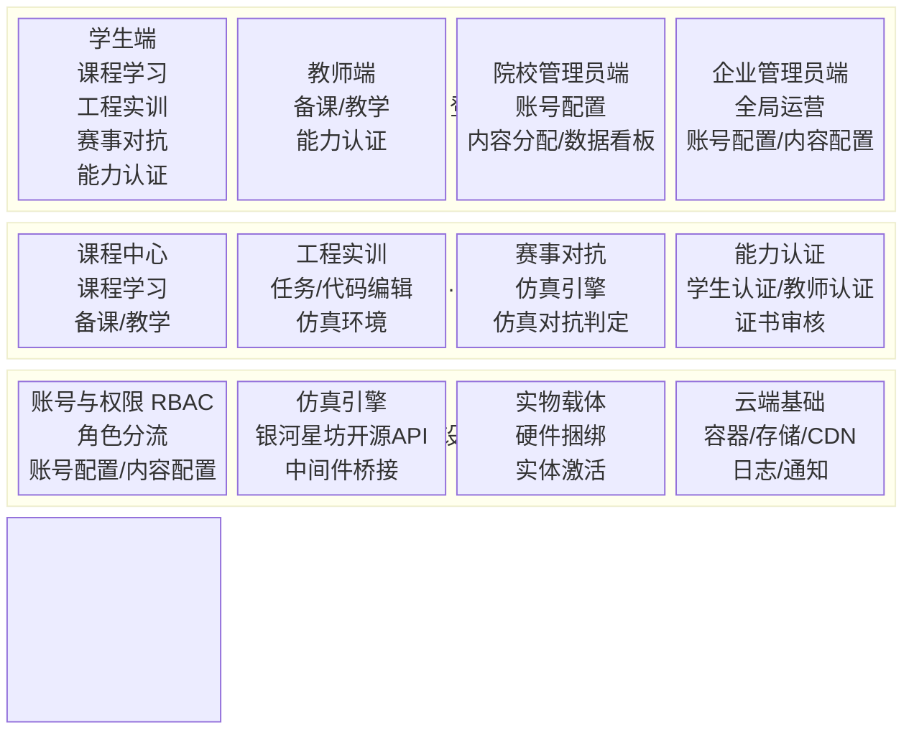
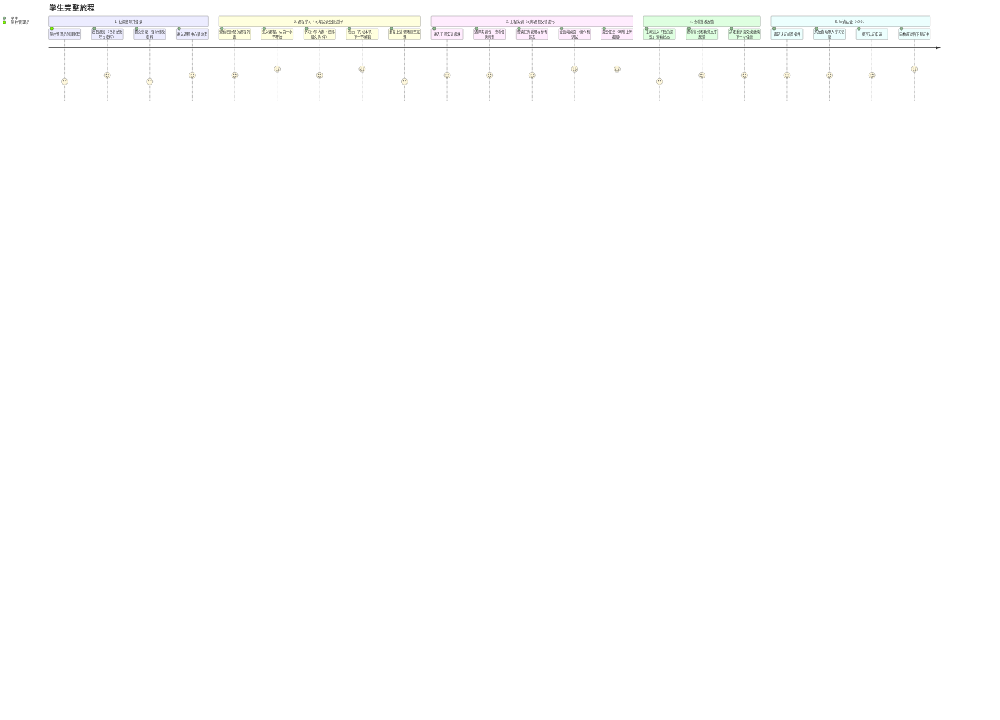
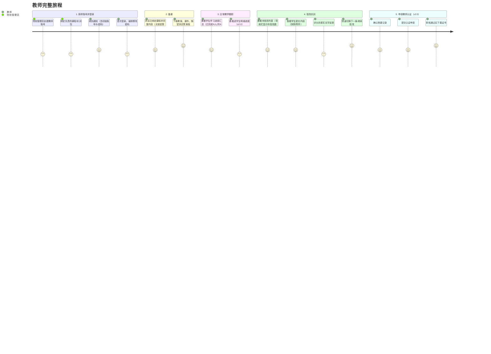
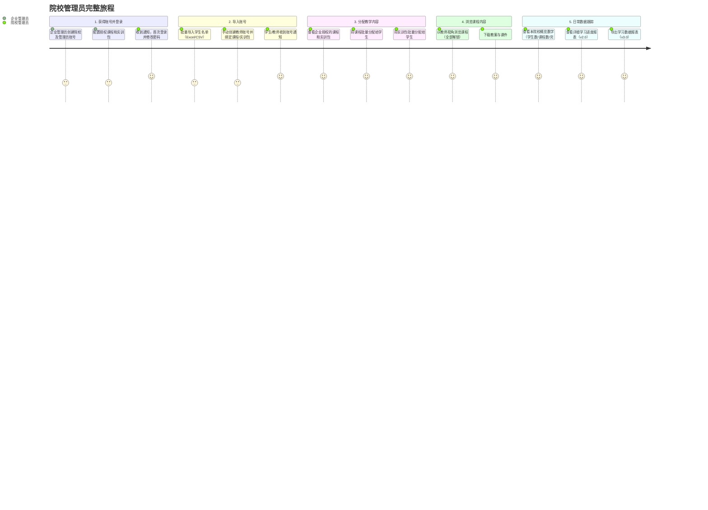
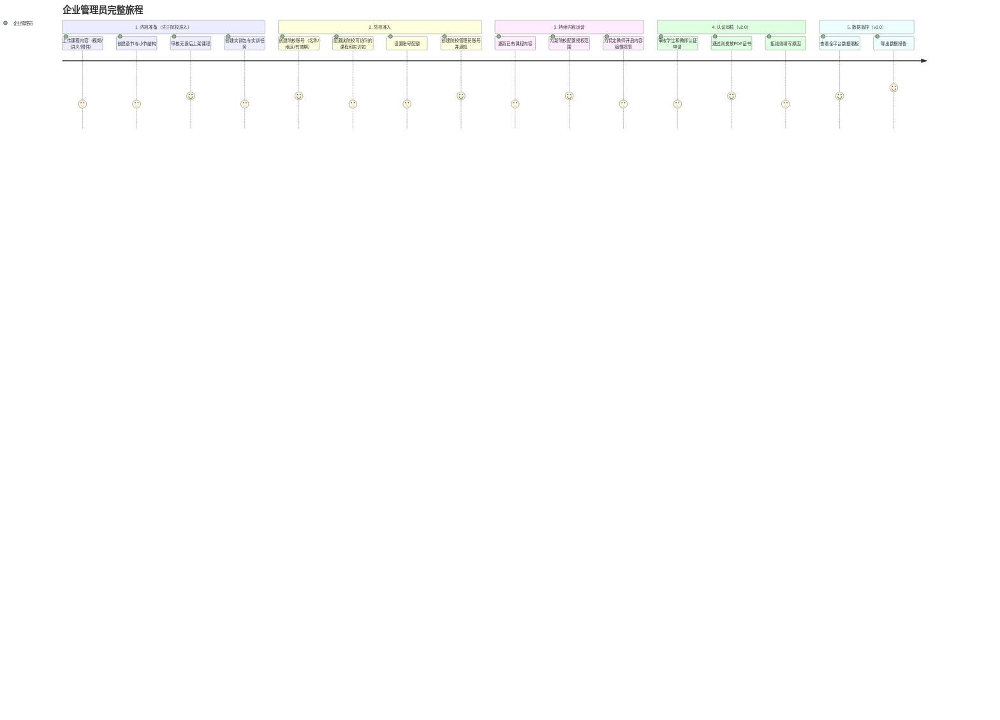
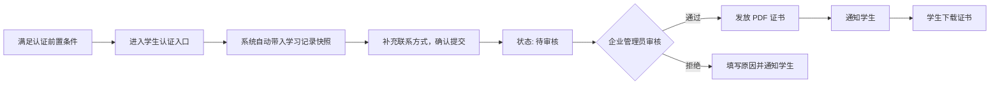
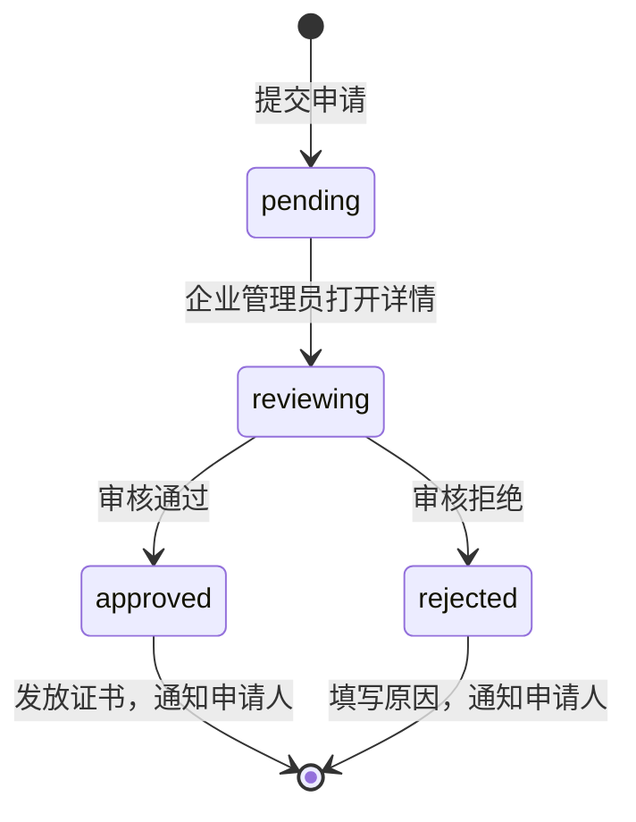

# 银河求索具身智能教育平台产品需求文档

## 零、文档信息

### 基本信息

| 项目 | 内容 |
|------|------|
| 标题 | 银河求索具身智能教育平台产品需求文档 |
| 版本 | 1.0.1 |
| 状态 | 待评审 |
| 撰写人 | 叶守淦 |
| 贡献者 | 朱辉、教育事业部各同事 |

### 修订历史

| 版本 | 日期 | 变更描述 | 修订人 | 状态 |
|------|------|----------|--------|------|
| 1.0.1 | 2026.03.30 | Review 修订：补充问题陈述、非目标章节、岗位就业定位、v2.0/v3.0 验收标准；完善指标测量方式与假设失败路径 | 叶守淦 | 待评审 |
| 1.0.0 | 2026.03.30 | 重构PRD：聚焦产品定义，移除商务内容与前端开发细节 | 叶守淦 | 待评审 |
| 0.5.0 | 2026.03.29 | 完善了框图与产品原型 | 叶守淦 | 已归档 |
| 0.4.0 | 2026.03.27 | 完善了核心功能与开发细节说明 | 叶守淦 | 已归档 |
| 0.3.0 | 2026.03.25 | 根据业务策略调整：移除访客/C端功能，v1.0首页改为登录页；课程中心与工程实训拆分独立 | 叶守淦 | 已归档 |

---

## 一、产品概述

### 1.1 产品定位

银河求索具身智能教育平台，是一款面向高职院校与应用本科、专注具身智能从业人员培养的一体化教育平台。

平台依托银河通用的云端仿真能力和真实行业落地经验，以**理论学习 → 工程实训 → 能力认证 → 岗位就业**为核心培养链路，构建从入门到就业的闭环体系；针对不同院校层次与学生基础，提供从虚拟仿真到真实硬件、从基础认知到前沿工程的分层解决方案。

> **平台为 B 端（院校）服务，不面向 C 端个人用户开放。** 平台内容不对外公开检索，未授权的院校无法访问平台内容。

### 1.2 问题陈述

**谁有这个问题？**
高职院校与应用本科中希望开设具身智能相关课程的院系。

**问题是什么？**
具身智能作为新兴方向，院校在教学交付上面临四重断层：**无课程**（缺乏体系化的具身智能教学内容）、**无师资**（现有教师缺乏具身智能工程经验）、**无环境**（缺少仿真实训平台和真实机器人调试设备）、**无标准**（行业认证体系空白，学生能力无法被用人单位量化评估）。

**为什么痛？**
政策层面已明确要求院校布局具身智能人才培养，但院校缺乏从零构建完整教学体系的能力和资源。课程内容、实训环境、师资培训、能力认证每一项都需要深厚的行业积累，单独解决任何一项都无法形成有效的教学闭环。

### 1.3 核心价值主张

**教师：** 提供拿来即用的完整教案、课件与实验脚本，无需从零备课；系统性培训支持教师快速建立具身智能教学能力。

**学生：** 提供与学生能力水平匹配的分层课程内容，降低入门门槛；将课程、认证与岗位的对应关系清晰呈现，强化学习动机。

**院校管理员：** 提供清晰的账号管理工具与数据查看能力，支撑日常教学运营；操作流程简洁，减少手动配置工作量。

**企业管理员：** 提供全平台内容管理与院校授权的统一操作后台，高效支撑多院校并行运营与内容迭代。

### 1.4 产品能力全景

平台以完整的人才培养链路为骨架，五个模块依次递进、相互支撑：

**① 理论学习（结构化知识体系）**
覆盖具身智能基础理论、前沿范式（VLA / 具身大模型 / Agent 驱动机器人）、数据采集与遥操作、机器人维修等内容，提供与学生水平匹配的分层课程路径。

**② 工程实训（可迁移工程能力）**
云端仿真环境与真实机器人调试双轨并行，覆盖导览、上下料、分拣、数采等工商业典型场景。工程实训作为独立模块与课程中心并列。

**③ 赛事对抗（竞争性学习动机）**
赛事由独立运营的赛事平台承接，教育平台提供统一的后端支撑能力（赛事引擎、仿真环境）。教育平台仅提供外部链接跳转入口，不内嵌赛事管理功能。

**④ 能力认证（可证明的能力信号）**
建立银河具身智能岗位资格证书体系，覆盖教师与学生双轨认证。当前行业无统一认证标准，平台认证以银河通用企业岗位能力为锚点，与行业用人标准挂钩。

**⑤ 岗位就业（可量化的就业结果）**
以银河通用自身的岗位需求为基础就业出口，为通过认证的学生提供优先就业通道。

---

## 二、背景

### 2.1 政策与市场环境

具身智能已在《"十五五"规划建议》中被明确列为"新经济增长点"，工信部人形机器人与具身智能标准化技术委员会于2025年12月正式成立。教育部同步推动AI赋能职业教育，鼓励院校与头部企业合作培养人才。

产业端，具身智能市场规模2030年预计达4000亿元，产业爆发创造出大量数据采集、模型训练、现场部署等岗位，而院校课程体系与此类岗位之间存在显著的供给断层。

### 2.2 竞品分析

> 详见：[竞品深度调研文档]（TODO：补充链接）

### 2.3 非目标（产品边界）

以下事项明确不在本产品范围内，用于防止范围蔓延和对齐团队预期：

| # | 非目标 | 原因 |
|---|--------|------|
| 1 | 不面向 C 端个人用户开放 | 平台为 B 端院校服务，获客与交付均通过院校/渠道商完成 |
| 2 | 教育平台不自建仿真引擎 | 仿真能力由仿真团队建设并开放 API，教育平台做集成层 |
| 4 | 教育平台不提供就业撮合/招聘功能（v4.0 前） | 当前阶段聚焦教学闭环，就业通道以认证 + 线下推荐为主 |
| 5 | 不做移动端原生 App | 主场景为院校机房桌面端，移动端以响应式 Web 适配为兜底 |
| 6 | 不自建内容制作工具 | 课程内容由内容团队线下制作后上传，平台不提供视频剪辑/课件编辑能力 |

---

## 三、目标用户

### 3.1 院校管理层（间接用户）

**核心诉求：有成果、不出事。**

院校副校长或教务处长，对政策信号高度敏感。非平台直接用户，关注的不是课程质量本身，而是平台能否帮助学校在指标评审、产教融合示范项目等维度上产出可汇报的成果。

**主要需求：**
- 可对上汇报的数据报表与教学成果
- 头部企业与头部院校背书，降低决策风险

### 3.2 院校管理员（含渠道商）

**核心诉求：能跑起来，能交差，出了问题有人管。**

实验室管理员或教务干事，执行层，没有决策权但有技术否决权。对平台的判断标准：会不会给他制造额外的麻烦。

**主要需求：**
- 院校级别的全量数据查看：课程分配情况、学生实训进度、账号管理
- 批量创建/导入学生和教师账号
- 将课程和实训包分配给学生/教师
- 查看本院校的学习数据汇总

> **渠道商模式：** 银河对接渠道时，由渠道商担任院校管理员，行使相同管理权限。v1.0～v3.0 不单独新增渠道商角色，后续版本视业务发展情况评估。

### 3.3 教师

**核心诉求：课能讲得出来，内容匹配学生水平，解决转型焦虑和课业负担。**

40岁+，机电或自动化背景，在职业院校有稳定的教学节奏和既有课程体系。具身智能不一定是主动选择的方向，时间和精力有限，不会为了一门新课打乱既有工作节奏。

**主要需求：**
- 最小化额外工作量：教案、课件、实验脚本全部备好，只需理解和讲授
- 出了问题不用自己解决：实验环境跑不起来有人处理，学生问题有参考答案
- 教师认证在职称评定、校内绩效或同行交流中有实际价值

### 3.4 学生

**核心诉求：学得会，投入小，学完有出路。**

高职在读，对职业前景有模糊焦虑但缺乏具体规划。注意力是稀缺资源，听说具身智能很火，不知道学了能不能就业。

**主要需求：**
- 清晰的就业路径（数采员、FAE、机器人应用工程师）
- 与自身水平匹配的分层内容，不因基础薄弱而被卡住
- 即时的激励：第一课必须能跑起来，前三十分钟内完成第一个可见的任务结果
- 学习成果与就业通道的真实连接

### 3.5 企业管理员

**核心诉求：** 对全平台的院校、内容、账号、数据拥有完整的管理和干预能力，高效支撑运营工作。

银河通用教育业务部门的内部运营和交付人员（内容运营、课程开发、交付工程师、商务支持等），统一在企业管理员权限下操作平台。

**主要需求：**
- **全局院校管理**：管理各院校的授权范围（开放模块、账号上限、到期时间）、部署状态
- **内容管理与发布**：对课程内容进行增删改发布，管理课程版本，配置院校内容访问权限
- **数据与报表**：全平台学习数据的汇总视图，支持按院校、时间维度下钻

---

## 四、产品架构

### 4.1 架构概述

平台采用三层架构设计：**接入层、核心业务层、基础设施层**。

单域名多角色分流机制，所有用户访问同一域名，首页即为登录页，登录后按角色进入对应视图与功能范围。平台不提供公开展示区或访客浏览功能。

核心业务优先围绕**课程中心**、**工程实训**两大子系统展开；赛事对抗作为外部链接跳转处理；能力认证将配合业务节奏后续上线。

仿真引擎由工程实训与赛事对抗共用，平台以集成层形式调用银河星坊开源 API，不自建仿真能力。

### 4.2 功能架构图

### 4.3 角色与权限层级

| # | 角色 | 创建者 | 数据范围 | 说明 |
|---|------|--------|----------|------|
| 1 | 企业管理员 | 系统内置 | 全平台 | 银河通用内部运营人员，全局管控 |
| 2 | 院校管理员 | 企业管理员 | 本院校 | 院校教务/渠道商人员，管理本院校的账号与内容分发 |
| 3 | 教师 | 院校管理员 | 绑定的课程/实训包 | 查看学生进度、批改实训；视图为学生视图的超集 |
| 4 | 学生 | 院校管理员 | 已分配的课程/实训包 | 学习与实训的核心用户 |

**增量视图原则**：四类角色共用同一套 URL，服务端根据角色返回对应视图。高权限角色的页面是低权限角色页面的超集——教师在学生视图基础上叠加备课层和批改层；院校管理员在教师视图基础上叠加账号管理层和内容分配层；企业管理员拥有独立的全平台运营视图。

### 4.4 用户旅程

> 以下旅程覆盖用户从首次接触到常态使用的完整生命周期。v2.0+ 才上线的步骤以「v2.0」「v3.0」标注，v1.0 用户不会经历这些步骤。

#### 4.4.1 学生旅程

**关键状态联动**

| # | 触发事件 | 联动结果 |
|---|----------|----------|
| 1 | 学生点击「完成本节」 | 当前小节标记完成，下一小节自动解锁 |
| 2 | 学生提交实训任务 | 提交记录创建，状态变为「待批改」；环境快照后台异步生成 |
| 3 | 教师完成批改 | 学生在「我的提交」中可查看得分与反馈（v1.0 无主动通知，需学生主动查看；v2.0 起推送站内通知） |
| 4 | 认证申请「审核通过」（v2.0） | 证书下载链接出现在认证页面，站内通知触达学生 |

#### 4.4.2 教师旅程

#### 4.4.3 院校管理员旅程

#### 4.4.4 企业管理员旅程

---

## 五、核心功能

### 5.1 账号与权限系统

账号是一切旅程的起点。平台采用基于角色的访问控制（RBAC），共四类角色，所有角色均需登录方可访问平台。

#### 5.1.1 院校准入流程（企业管理员操作）

院校授权后，企业管理员在后台完成以下配置：

- **创建院校账号**：填写院校名称、所在地区、有效期
- **配置授权范围**：选择该院校可访问的课程列表和实训包列表；设置账号上限（学生总人数、教师总人数）；设置授权有效期
- **创建院校管理员账号**：填写账号信息，通知院校管理员登录

#### 5.1.2 院校内部账号管理（院校管理员操作）

**批量导入学生账号**
- 上传学生名单（Excel/CSV 格式），系统批量创建账号并生成初始密码
- 导入前进行格式预校验（列名、必填字段、邮箱格式），错误直接提示
- 必填字段：姓名、班级、邮箱；选填字段：手机号、学号
- 处理完成后展示结果：成功/失败统计 + 失败行明细（行号 + 原因）
- 账号创建后通知学生登录并修改初始密码
- 支持手动单个新增账号

**创建教师账号**
- 填写教师基本信息，创建账号
- 新建教师时可直接绑定其负责管理的课程和实训包
- 绑定关系可随时修改

**账号状态管理**
- 支持禁用/启用账号（学生转学、教师离职等场景）；禁用后账号无法登录，数据保留
- 支持重置密码；重置后下次登录强制改密

#### 5.1.3 边界与异常处理

| 场景 | 处理逻辑 |
|------|----------|
| 院校账号数已达上限 | 阻止创建，提示「已达账号上限，请联系银河管理员」 |
| 院校授权到期 | 院校所有用户登录后提示授权已到期，无法访问课程和实训内容；账号数据保留 |

### 5.2 课程中心

课程中心是平台的知识内容核心，承载学生从入门到建立系统认知的完整学习过程。

> **首批上架内容：** 银河通用与清华大学联合开发的 240 学时课程。

#### 5.2.1 模块定位与边界

**v1.0 定位**：课程中心是独立的内容学习模块，不与工程实训发生跳转联动。学生在课程中心完成理论学习，在工程实训模块完成动手实践，两者并列存在，由学生自行对应。

**内容结构**：三级结构：**课程 → 章节 → 小节**，小节是最小学习单元。

**v1.0 小节类型**：

| 类型 | 说明 |
|------|------|
| 视频 | 在线视频，播放进度自动保存，下次进入从断点续播；视频必须播放至末尾，「完成」按钮才可点击 |
| 富文本 | 图文内容，滚动阅读；无强制阅读完限制，可直接点「完成」 |
| 附件 | 附件下载型（PDF/PPT/文档等），支持多附件；含随堂测试 PDF 时加注标签；学生本地完成，不在平台提交 |

> v2.0 新增 training_link 小节类型（课程内嵌「进入实训」跳转按钮）。v2.0 新增交互式随堂测试，作为实训的轻量级形式纳入实训模块。

#### 5.2.2 学生视角：从分配到完课

**进入课程**

学生登录后，落地页展示院校管理员已分配给自己的课程列表（学生不可自选课程）。列表支持按**岗位路径**和**能力级别**（入门/初级/中级/高级）筛选。

点击课程卡片进入课程详情页，左侧展示章节目录（含每小节的解锁状态），右侧为内容展示区。

**顺序解锁学习**

- 第一个小节默认解锁，其余小节处于锁定状态
- 完成当前小节（手动点击「完成本节」）后，自动解锁下一小节
- 跨章节同样适用：完成当前章节最后一小节，自动解锁下一章节第一小节
- 已完成的小节可随时回访

**消费小节内容**

进入小节后，根据类型展示对应内容，均在课程详情页内渲染，不跳转新页面：

- **视频**：在线播放，播放进度自动保存，下次进入从断点续播
- **富文本**：图文内容，滚动阅读
- **附件**：展示附件列表（文件名、类型、大小），每个附件有独立下载按钮；含随堂测试 PDF 时加注标签

点击「完成本节」后，当前小节标记为已完成，下一小节自动解锁。

#### 5.2.3 教师视角（学生视图的超集）

教师访问课程时，在学生基础视图上叠加以下增量内容：

**备课增量**
- 全部小节无锁定限制，可直接访问任意小节
- 附件型小节中，额外展示教案文件、课件文件、随堂测试答案版 PDF（标注「仅教师可见」）
- 课程卡片底部进度条变为人数摘要「已完成 N 人 / 共 N 人」

**学生进度跟踪**
- v1.0：查看本课学生的基础学习进度汇总（已完成 N 人 / 共 N 人）
- v2.0：详细进度列表页，支持逐学生查看进度

**课程内容编辑（需企业管理员开启权限）**
- 创建/编辑章节和小节
- 上传视频、编辑富文本、上传附件
- 只能操作自己绑定或创建的课程

#### 5.2.4 院校管理员视角（教师视图的超集）

在教师视图基础上额外拥有：

**分配课程**
- 从企业管理员授权给本院校的已上架课程列表中选择课程
- 批量分配给全体学生或指定学生（支持按班级筛选）
- 将课程绑定给教师（绑定后教师才可查看该课程的学生数据）

**查看学习数据**
- v1.0：查看本院校已注册学生数、教师数、已分配课程数等概览数字
- v2.0：学习进度详细报表
- v3.0：数据导出（Excel 格式）

#### 5.2.5 企业管理员视角：内容运营

企业管理员通过独立入口对全平台课程内容拥有完整管理权限：

- **内容管理**：创建/编辑/删除课程、章节、小节；课程上架/下架（下架后新分配不可见，已分配学生的在读进度不受影响）
- **关联配置**：配置课程与岗位路径、能力级别的关联关系
- **授权管理**：设置各院校可访问的课程列表及有效期；为特定教师开启/关闭课程编辑权限
- **数据查看**：全平台各课程的使用数据

#### 5.2.6 边界与异常处理

| 场景 | 处理逻辑 |
|------|----------|
| 学生尝试访问未解锁的小节 | 点击无响应，提示「完成上一小节后解锁」 |
| 课程被下架 | 已分配的学生不受影响，可继续学习；新分配入口对院校管理员不可见 |
| 院校授权到期 | 学生/教师无法访问课程内容，提示「授权已到期，请联系管理员」 |

### 5.3 工程实训

工程实训是平台的核心动手实践模块，与课程中心并列存在，独立运营。

#### 5.3.1 模块定位与边界

**v1.0 定位**：工程实训独立入口访问，与课程中心完全独立，不做跳转联动。

**v1.0 实训环境**：Linux 及 Windows 云端桌面环境（iframe 嵌入，全屏可交互）。

> v2.0 升级：引入银河星坊仿真 API（Isaac Lab + Newton），实训任务页升级为三栏布局（任务说明 + 代码编辑器 + 仿真窗口），代码与机器人行为实时联动。Linux/Windows 实训与仿真实训并存，按任务类型配置。

**实训与随堂测试的关系**：v1.0 中随堂测试以 PDF 附件形式存放在课程小节中。v2.0 起随堂测试将作为实训的一种轻量形式并入实训模块统一管理。

#### 5.3.2 学生视角：从领取任务到收到反馈

**进入实训**

学生进入实训模块，展示院校管理员已分配的实训包列表。点击实训包进入任务列表页，每条任务显示名称和当前提交状态（未提交/待批改/已批改+得分）。

**完成实训任务**

进入实训任务页后，页面为左右分栏布局：
- **左侧**：任务说明区，展示任务目标、操作步骤、注意事项；下方折叠区域提供参考答案/示例代码
- **右侧**：Linux/Windows 云端桌面（可操作的桌面视图）

学生按照任务说明完成操作，支持反复调试。

**提交**

点击「提交」后确认：
- 创建提交记录
- 对实训环境拍摄快照（后台异步）
- 可选上传附件（截图、文档等辅助材料）
- 提交状态进入「待批改」
- 支持多次提交，教师批改最新一次

**收到批改反馈**
- v1.0：学生需主动查看批改状态
- 批改详情展示：得分（0–100）、教师文字反馈
- 查看反馈后可决定是否重新提交

> v2.0 起：教师批改完成后，学生收到站内通知。

#### 5.3.3 教师视角（学生视图的超集）

**批改能力**
- 实训导航标签显示待批改数量
- 批改列表：展示已绑定实训包下所有学生的提交记录，支持按实训包和批改状态筛选
- 批改操作：查看学生提交内容（环境快照、上传附件）、评分（0–100）、填写文字反馈
- 支持在批改列表中快速切换上/下一条，无需返回列表

**实训内容编辑（需企业管理员开启权限）**
- 创建/编辑实训任务内容
- 只能操作自己绑定或创建的实训包

#### 5.3.4 院校管理员视角（教师视图的超集）

**分配实训包**
- 从企业管理员授权给本院校的实训包列表中选择
- 批量分配给全体学生或指定学生

**查看实训数据**
- v1.0：查看本院校实训包完成率等概览数字

#### 5.3.5 企业管理员视角：内容运营

企业管理员通过独立入口管理全平台实训内容：

- **内容管理**：创建/编辑/删除实训包和实训任务（任务说明、操作步骤、参考答案/示例代码）
- **权限管理**：对特定教师开启/关闭实训内容编辑权限
- **授权管理**：配置各院校可访问的实训包范围
- **数据查看**：全平台实训完成数据

#### 5.3.6 边界与异常处理

| 场景 | 处理逻辑 |
|------|----------|
| 学生访问未分配的实训包 | 提示「您没有访问权限，请联系院校管理员」 |
| 实训环境连接异常 | 展示重试入口，错误信息写入后台日志 |
| 学生多次提交同一任务 | 每次独立记录，教师批改最新一次，历史记录可查 |
| 教师重复批改同一提交 | 允许覆盖，更新分数和反馈 |

### 5.4 赛事对抗

#### 5.4.1 定位说明

赛事由独立的赛事平台运营，银河提供统一的后端支撑能力（赛事引擎、仿真环境），供不同赛事品牌的前端独立调用。

**教育平台不直接承接赛事业务，不内嵌赛事管理功能。**

| 版本 | 教育平台侧动作 |
|------|----------|
| v1.0 | 不提供任何赛事入口 |
| v2.0/v3.0 | 视赛事平台成熟度评估是否提供外部链接跳转入口 |

#### 5.4.2 后端支撑能力（非教育平台产品范围）

以下能力由技术侧统一建设，供赛事前端调用，不属于教育平台产品范围：
- 赛事管理后台（赛事创建、赛题管理、队伍审核、成绩公布）
- 赛事仿真环境（共用银河星坊仿真引擎）
- 赛事数据存储与 API 接口

### 5.5 能力认证

#### 5.5.1 定位说明

能力认证模块提供银河求索岗位资格证书的申请与发放功能。当前行业无统一认证标准，平台认证以银河通用企业岗位能力为锚点。

| 版本 | 认证侧动作 |
|------|----------|
| v1.0 | 不上线，不展示认证入口 |
| v2.0 | 上线学生认证与教师认证完整申请流程；企业管理员人工审核，线上发放 PDF 证书 |
| v4.0+ | 评估审核自动化程度 |

#### 5.5.2 v2.0 功能预规划

**学生认证流程**

**认证申请前置条件**：学生需完成指定课程和实训任务（具体达标标准——如完成课程数、实训通过分数线——由企业管理员在后台按认证类型配置，v2.0 上线前需明确首批认证的具体达标规则）。

**教师认证流程**

与学生认证基本一致，差异：
- 独立入口：教师认证
- 额外必填字段：所在院系
- 自动带入内容为授课记录（已绑定课程列表、已创建课程列表）

**审核状态流转**

**院校管理员视图（v2.0）**：查看本院校认证统计（申请数/通过数/待审核数）。

**企业管理员视图（v2.0）**：
- 申请列表：按类型、状态筛选
- 申请详情：申请人填写内容 + 平台自动带入的记录快照
- 执行审核：通过后发放证书；拒绝后填写原因

### 5.6 岗位就业

#### 5.6.1 定位说明

岗位就业是培养链路的终点，目标是将学习成果转化为可量化的就业结果。**当前版本（v1.0～v3.0）不在平台内提供就业功能模块。**

就业通道在 v3.0 前以线下方式运作：通过认证的学生由银河通用内部推荐至自身岗位或合作企业。平台侧仅提供认证数据作为推荐依据，不承担招聘撮合功能。

| 版本 | 就业侧动作 |
|------|----------|
| v1.0～v3.0 | 不上线，无平台入口。就业推荐以线下方式进行 |
| v4.0+ | 评估是否在平台内增加岗位展示、简历投递等功能，视认证体系成熟度与企业合作规模决定 |

### 5.7 权限一览表（v1.0）

**符号说明**：✅ 有权限　❌ 无权限　🔓 需企业管理员开启权限后生效　📌 仅限本院校数据范围

#### 账号与院校管理

| 功能 | 学生 | 教师 | 院校管理员 | 企业管理员 |
|------|------|------|----------|----------|
| 修改个人账号信息 | ✅ | ✅ | ✅ | ✅ |
| 重置个人密码 | ✅ | ✅ | ✅ | ✅ |
| 批量导入/创建学生账号 | ❌ | ❌ | ✅📌 | ✅ |
| 创建/管理教师账号 | ❌ | ❌ | ✅📌 | ✅ |
| 禁用/启用账号 | ❌ | ❌ | ✅📌 | ✅ |
| 创建院校管理员账号 | ❌ | ❌ | ❌ | ✅ |
| 配置院校授权范围/有效期 | ❌ | ❌ | ❌ | ✅ |

#### 课程中心

| 功能 | 学生 | 教师 | 院校管理员 | 企业管理员 |
|------|------|------|----------|----------|
| 查看已分配课程列表 | ✅ | ✅（全览） | ✅📌 | ✅ |
| 顺序解锁学习小节 | ✅ | ❌（无限制） | ❌（无限制） | ❌ |
| 下载附件（教案/课件/答案版） | ❌ | ✅ | ✅ | ✅ |
| 查看学生学习进度 | ❌ | ✅📌 | ✅📌 | ✅ |
| 将课程分配给学生/教师 | ❌ | ❌ | ✅📌 | ✅ |
| 编辑课程内容 | ❌ | 🔓 | ❌ | ✅ |

#### 工程实训

| 功能 | 学生 | 教师 | 院校管理员 | 企业管理员 |
|------|------|------|----------|----------|
| 查看已分配实训包 | ✅ | ✅📌 | ✅📌 | ✅ |
| 完成实训任务并提交 | ✅ | ❌ | ❌ | ❌ |
| 查看自己的提交记录和反馈 | ✅（仅自己） | ❌ | ❌ | ❌ |
| 查看学生提交列表 | ❌ | ✅📌 | ✅📌 | ✅ |
| 批改实训 | ❌ | ✅📌 | ❌ | ❌ |
| 将实训包分配给学生 | ❌ | ❌ | ✅📌 | ✅ |
| 编辑实训内容 | ❌ | 🔓 | ❌ | ✅ |

#### 能力认证（v2.0 上线）

| 功能 | 学生 | 教师 | 院校管理员 | 企业管理员 |
|------|------|------|----------|----------|
| 提交学生认证申请 | v2.0 | ❌ | ❌ | ❌ |
| 提交教师认证申请 | ❌ | v2.0 | ❌ | ❌ |
| 查看本院校认证统计 | ❌ | ❌ | v2.0📌 | ✅ |
| 审核认证申请/发放证书 | ❌ | ❌ | ❌ | v2.0 |

---

## 六、版本规划

### 6.1 版本规划原则

迭代路线按**模块成熟度**分期推进：核心学习链路优先，工程实训逐步完善，认证体系后置，赛事以后端支撑为主。各版本节奏为目标，实际排期视资源情况调整。

### 6.2 v1.0 — 目标：2026 年 5 月中旬

**核心目标**

完成平台从零到一的冷启动验证：学生能在平台上完成课程学习和实训，教师能查看进度并批改，企业管理员能完成内容上传和账号授权。

首批上架内容为银河通用与清华大学联合开发的 240 学时课程。

**纳入范围**

| 模块 | 内容 | 说明 |
|------|------|------|
| 课程中心 | 课程三级结构、顺序解锁、视频/富文本/附件小节、教师视图与进度查看、院校管理员课程分配 | 随堂测验和实训跳转暂不包含 |
| 工程实训 | Linux/Windows 云端桌面环境、实训任务与提交、教师手动批改、院校管理员实训包分配 | 无仿真窗口 |
| 账号系统 | RBAC 四角色、院校准入、批量导入、登录/改密 | — |

**不纳入范围**

| 功能 | 原因 |
|------|------|
| 访客浏览/公开展示区 | 平台不面向 C 端 |
| 课程内跳转至实训 | 模块间映射需先建立清晰对应关系，v2.0 上线 |
| 随堂测试交互 | v1.0 以 PDF 附件替代 |
| 赛事对抗 | v1.0 不提供任何入口 |
| 能力认证 | v2.0 起上线 |
| 站内通知系统 | v2.0 起上线 |
| 数据看板/报表导出 | v3.0 起上线 |

**验收标准**

- 院校管理员可独立完成学生账号批量导入
- 学生可完整访问分配给自己的课程，顺序解锁正常运转
- 学生可在 Linux/Windows 实训环境中完成操作并提交
- 教师可查看学生学习进度并完成实训批改
- 企业管理员可完成课程内容上传和院校授权配置
- 首页为登录页，无任何未登录可见内容

### 6.3 v2.0 — 目标：2026 年 7 月初

**核心目标**

引入仿真引擎，升级工程实训形态；建立课程中心与工程实训的跳转关联；上线能力认证；完善通知系统。

**新增内容**

- **课程中心**：training_link 小节类型上线；教师课程创作权限（企业管理员开关控制）
- **工程实训**：引入银河星坊仿真 API（Isaac Lab + Newton）；三栏布局（任务说明 + 代码编辑器 + 仿真窗口）；Linux/Windows 与仿真实训并存
- **能力认证**：学生认证与教师认证完整流程；企业管理员审核后台；院校管理员认证统计视图
- **基础能力**：站内通知系统；访客公开展示区；实物载体绑定激活

> **仿真引擎说明：** 银河星坊 API 集成细节单独讨论，此处节奏为目标，视工程实际情况调整。

**验收标准**

- 仿真实训任务可正常加载、运行并提交，代码编辑与仿真窗口实时联动
- 课程小节内「进入实训」跳转按钮正常工作，学生可从课程直接进入对应实训任务
- 认证申请流程端到端走通：学生/教师提交 → 企业管理员审核 → 证书发放 → 申请人下载
- 站内通知可正常触达（批改完成、认证审核结果）

### 6.4 v3.0 — 目标：2026 年 8 月初

**核心目标**

仿真引擎与真实机器人打通；评估赛事跳转入口；完善数据体系。

**新增内容**

- **赛事跳转**（视赛事平台成熟度）：提供外部链接跳转入口
- **数据与报表**：全平台数据看板（企业管理员）；院校维度学习数据导出（院校管理员）；认证通过率统计
- **课程中心**：教师自建课程（完整创作流程）；课程版本管理
- **工程实训**：仿真实训与真实机器人的部分迁移支持

**验收标准**

- 企业管理员数据看板可展示全平台核心数据（活跃院校、学生数、完成率等）
- 院校管理员可导出本院校学习数据报表（Excel 格式）
- 教师可通过完整创作流程自建课程并上架
- （若赛事跳转上线）教育平台内赛事入口可正常跳转至赛事平台

### 6.5 v4.0 及后续

方向性规划，具体在 v3.0 上线后根据数据和用户反馈重新评估：

- 认证审核流程优化（评估自动化程度）
- 院校数据报表标准模板
- 渠道商独立角色与跨院校内容分发
- 就业推荐功能
- 教师 AI 辅助批改

### 6.6 版本功能对照表

| # | 功能模块 | v1.0（5月中） | v2.0（7月初） | v3.0（8月初） | v4.0+ |
|---|----------|:---:|:---:|:---:|:---:|
| 1 | 首页（登录页） | ✅ | ✅ | ✅ | ✅ |
| 2 | 课程中心（基础） | ✅ | ✅ | ✅ | ✅ |
| 3 | 课程内跳转实训 | ❌ | ✅ | ✅ | ✅ |
| 4 | 随堂测试（PDF 附件） | ✅ | ✅ | ✅ | ✅ |
| 5 | 随堂测试（交互式） | ❌ | ❌ | 评估 | 评估 |
| 6 | 工程实训（Linux/Windows） | ✅ | ✅ | ✅ | ✅ |
| 7 | 工程实训（仿真） | ❌ | ✅ | ✅ | ✅ |
| 8 | 工程实训（真实Galbot机器人） | ❌ | ❌ | 部分 | ✅ |
| 9 | 赛事跳转入口 | ❌ | ❌ | 评估 | ✅ |
| 10 | 能力认证 | ❌ | ✅ | ✅ | ✅ |
| 11 | 站内通知 | ❌ | ✅ | ✅ | ✅ |
| 12 | 数据看板/报表导出 | ❌ | ❌ | ✅ | ✅ |

---

## 七、成功指标

### 7.1 功能完整度

各版本以验收标准为基准，核心功能验收通过率需达 100%。具体验收项见各版本"验收标准"章节。

### 7.2 系统质量

| 指标 | 目标值 | 测量方式 | 评估时间点 |
|------|--------|----------|-----------|
| 平台可用性（uptime） | ≥99.5% | 运维监控（Prometheus / UptimeRobot 或同类） | 每月统计，v1.0 上线首月建立基线 |
| 首屏加载时间（LCP） | ≤2.5s | Lighthouse CI / 真实用户监控（RUM） | 每次发版后回归测试；首批院校网络环境实测 |
| 交互延迟（INP） | ≤200ms | Lighthouse CI / RUM | 同上 |
| 并发承载 | 支持单院校 200 人同时在线 | 压力测试工具（k6 / JMeter 或同类） | v1.0 上线前完成压测；v3.0 前按多院校并行重新评估 |

### 7.3 用户行为数据（埋点收集）

以下数据通过埋点收集，用于产品迭代参考，不设硬性目标值：

- 学生周活跃率（WAU / 总注册学生数）
- 课程完成率（完成全部小节 / 已分配学生数）
- 实训提交率（至少提交一次 / 已分配学生数）
- 教师平均批改周转时间
- 各功能模块的使用频次与路径

---

## 八、关键假设与风险

### 关键假设

| # | 假设 | 验证方式 | 验证时间点 | 若不成立 |
|---|------|----------|-----------|----------|
| A1 | 高职院校对具身智能课程有真实采购需求 | 首批院校使用反馈 | v1.0 上线后 | 调研院校真实顾虑，评估是否调整目标院校层次或内容方向 |
| A2 | 教师愿意使用平台提供的教学包授课，而非坚持自有教学体系 | 教师实际使用率 | v1.0 运行 4 周后 | 调研阻力原因，提前开放教师自定义内容能力（原计划 v3.0） |
| A3 | 学生在课程和实训中的完成率足以支撑认证体系的可信度 | 完课率和实训提交率（埋点数据） | v1.0 运行 8 周后 | 分析弃学节点，优化课程难度梯度和实训引导流程，再验证后决定认证上线节奏 |
| A4 | 银河通用的企业认证对学生有足够吸引力 | 认证申请人数、学生访谈反馈 | v2.0 上线后 | 暂停认证模块投入，将资源转向实训体验优化；同步推进外部认证合作增强背书 |
| A5 | 渠道商能复用院校管理员角色，不需要独立的渠道商功能 | 渠道商运营过程中的问题反馈 | v1.0～v3.0 持续观察 | 提前规划渠道商独立角色，在 v3.0 而非 v4.0+ 引入 |

### 风险登记

| # | 风险描述 | 影响 | 可能性 | 缓解策略 |
|---|----------|------|--------|----------|
| R1 | 首批 240 学时课程内容未能在 v1.0 前完成制作 | v1.0 上线但无内容可用 | 中 | 内容团队独立排期追踪；设定最低可用内容量（如前 80 学时），分批上线 |
| R2 | 云端桌面环境在校园网环境下延迟过高 | 学生实训体验差 | 中 | v1.0 前在目标院校网络环境进行压力测试；准备本地部署降级方案 |
| R3 | 仿真引擎（银河星坊 API）v2.0 前未能达到可集成状态 | v2.0 核心能力缺失 | 中高 | 与仿真团队建立周同步机制；v2.0 保留 Linux/Windows 实训作为兜底 |
| R4 | 校园网防火墙拦截 WebSocket/iframe 嵌入 | 实训环境无法正常使用 | 中 | 提前与院校 IT 部门沟通网络要求；准备替代连接方案 |

---

## 九、依赖关系

### 内部依赖

| 依赖方 | 依赖内容 | 影响版本 | 当前状态 |
|--------|----------|----------|----------|
| 内容团队 | 清华联合开发 240 学时课程内容（视频、讲义、教案、实训脚本） | v1.0 | 待确认 |
| 仿真团队 | 银河星坊仿真 API（Isaac Lab + Newton）的可集成版本 | v2.0 | 待确认 |
| 赛事团队 | 赛事平台前端独立上线，提供可跳转的 URL | v3.0 | 待确认 |
| 运维/基建 | 云端桌面环境部署、容器编排、CDN 配置 | v1.0 | 待确认 |

### 外部依赖

| 依赖方 | 依赖内容 | 影响 | 风险等级 |
|--------|----------|------|----------|
| 云桌面服务商 | Linux/Windows 云端桌面 iframe 嵌入方案的稳定性与延迟 | 实训体验 | 中 |
| 院校 IT 部门 | 校园网环境支持 WebSocket/iframe，无防火墙拦截 | 部署可行性 | 中 |

---

## 十、待决事项

| # | 问题 | 影响范围 | 决策时间点 |
|---|------|----------|-----------|
| 1 | v2.0 课程与实训的映射关系如何建立？按课程小节映射还是按实训包整体映射？ | 课程中心、工程实训 | v1.0 上线后根据使用情况决定 |
| 2 | 仿真实训的算力供给方案与定价模型 | 工程实训 | v2.0 规划阶段 |
| 3 | 教师认证的外部价值挂钩方式（职称评定、行业认可） | 能力认证 | v2.0 规划阶段 |
| 4 | 渠道商是否需要独立角色与跨院校管理能力 | 账号系统 | v3.0 后评估 |
| 5 | 随堂测试交互式形态的具体需求（题型、自动判分规则） | 课程中心、工程实训 | v3.0 评估 |
| 6 | 认证申请的具体达标规则（完成课程数、实训通过分数线等） | 能力认证 | v2.0 开发前确定 |
