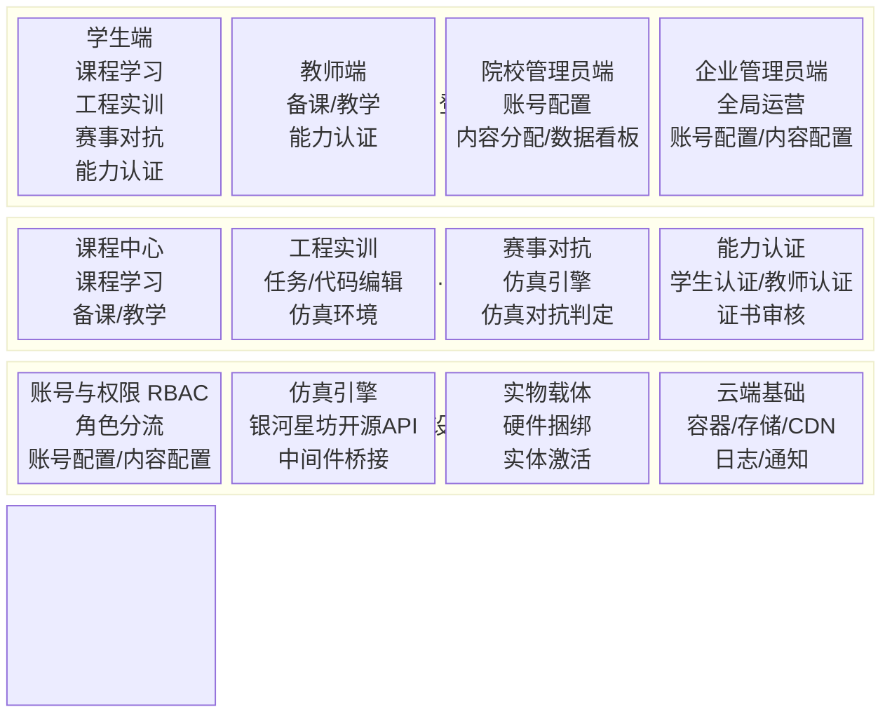
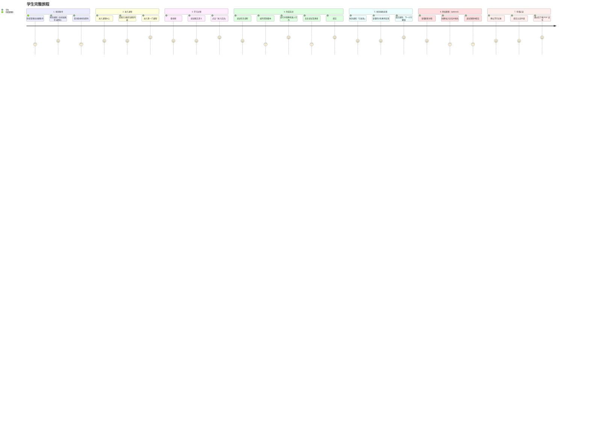
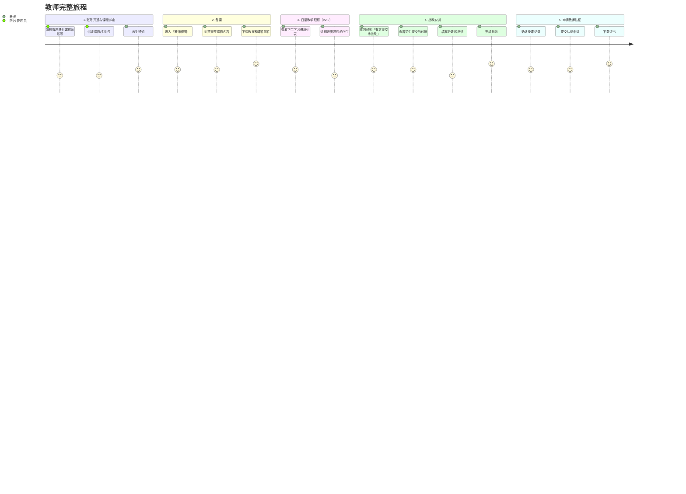
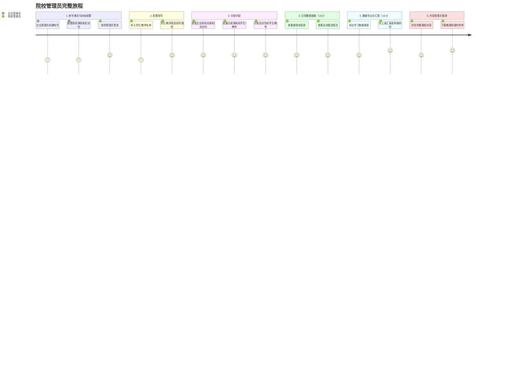
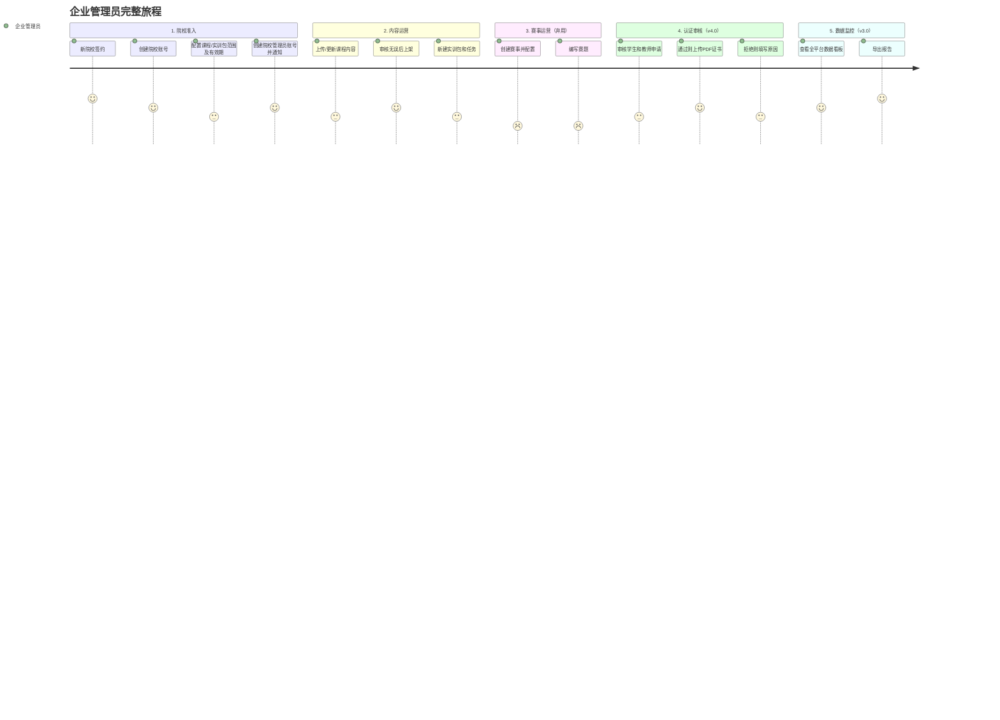
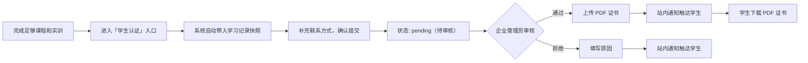
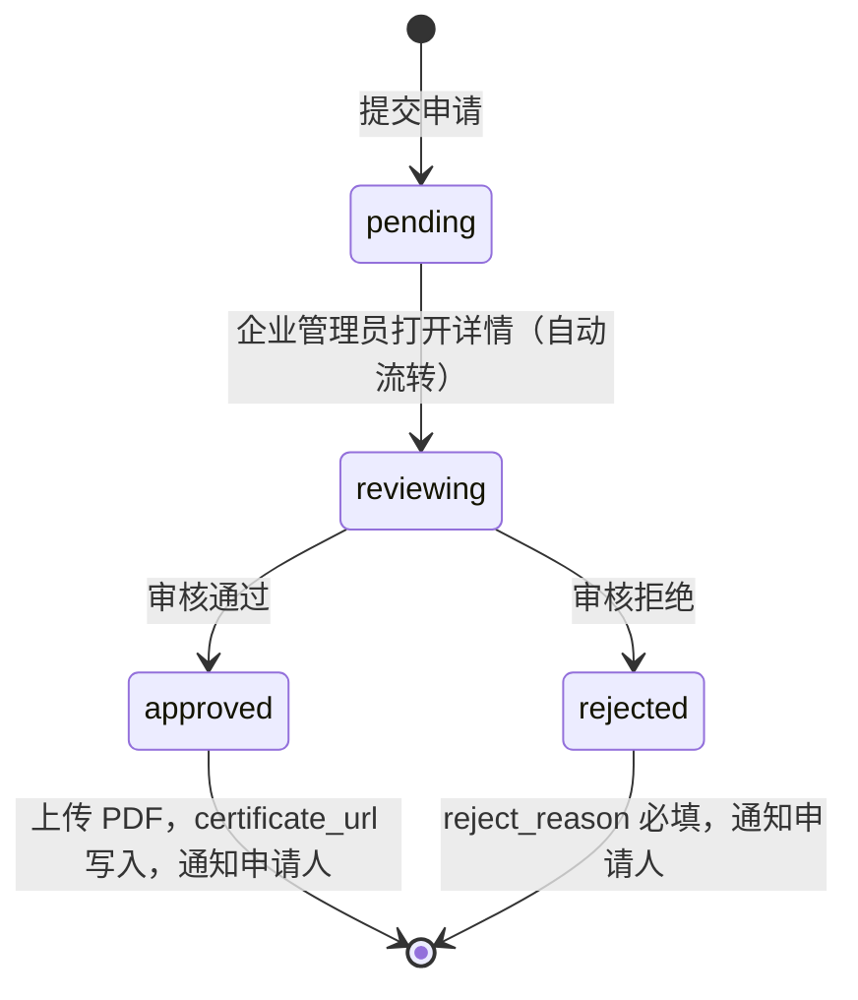

# 银河求索具身智能教育平台产品需求文档

## 零、文档信息

### 基本信息

| 项目 | 内容 |
|------|------|
| 标题 | 银河求索具身智能教育平台产品需求文档 |
| 版本 | 0.5.0 |
| 状态 | 待评审（全员） |
| 撰写人 | 叶守淦 |
| 贡献者 | 朱辉、教育事业部各同事 |

### 修订历史

| 版本 | 日期 | 变更描述 | 修订人 | 状态 |
|------|------|----------|--------|------|
| 0.5.0 | 2026.03.29 | 完善了框图与产品原型 | 叶守淦 | 待评审（全员） |
| 0.4.0 | 2026.03.27 | 完善了核心功能与开发细节说明 | 叶守淦 | 待评审（全员） |
| 0.3.0 | 2026.03.25 | 根据业务策略 TODO 做全面调整：移除访客/C 端功能，v1.0 首页改为登录页；课程中心与工程实训拆分独立，v1.0 不做模块间跳转；v1.0 移除随堂测试交互，仅保留 PDF 附件；赛事改为后端支撑 + 链接跳转形态，v1.0 不含跳转；能力认证后移至 v2.0；算力不在产品侧体现；版本节奏更新；补充渠道商说明。 | 叶守淦 | 待评审（全员） |
| 0.2.0 | 2026.03.24 | 调整功能细节、优先级、排期；弱化"赛事对抗"模块在平台上的前端呈现，转为后端支撑 | 叶守淦 | 已评审（业务侧） |
| 0.1.0 | 2026.03.23 | 初始版本定义 | 叶守淦 | 已评审（业务侧） |

---

## 一、产品概述

### 1.1 产品定位

**中国具身智能人才培养的首个完整闭环平台。**

银河求索具身智能教育平台，是一款面向高职院校与应用本科、专注具身智能从业人员培养的一体化教育平台。

平台依托银河通用行业领先的云端仿真能力和真实行业落地经验，以**理论学习 → 工程实训 → 能力认证 → 岗位就业**为核心培养链路，构建从入门到就业的闭环体系；针对不同院校层次与学生基础，提供从虚拟仿真到真实硬件、从基础认知到前沿工程的分层解决方案。

> **注意：** 平台为 B 端（院校/渠道商）服务，不面向 C 端个人用户开放。平台内容不对外公开检索，销售与合作洽谈统一走官网渠道。未付费/未授权的院校无法访问平台内容。

### 1.2 核心价值主张

平台围绕院校采购决策链中的四类核心角色，分别提供差异化价值：

**院校管理层（决策者）**

政策红利期内，提供可直接使用的申报材料模板（覆盖"双高"、"产教融合"、"岗课赛证融通"等话语体系）、可对上汇报的标志性成果（产业学院挂牌、微专业、联合体名单），以及头部企业与头部院校双重背书，降低"第一个吃螃蟹"的决策风险。

**院校教务/实验室管理员（技术验收方）**

提供清晰的技术对接文档与账号管理工具；支持捆绑硬件部署，满足"固定资产实物"的合规要求；配置专属交付工程师跟进验收，建立技术支持 SLA，明确响应时间承诺。

**专业教师（使用者与内容交付者）**

提供拿来即用的完整教案、课件与实验脚本，无需从零备课；为教师提供系统性培训；提供"具身智能教师认证"证书，将相关经历转化为教师个人职业发展资产。

**在校学生（核心学习者）**

将"课程 → 认证 → 岗位 → 薪资范围"的对应关系直接呈现，强化学习动机；提供与学生能力水平匹配的分层课程内容，降低入门门槛。

### 1.3 产品能力全景

平台以完整的人才培养链路为骨架，五个模块依次递进、相互支撑：

**① 理论学习（结构化知识体系）**
覆盖具身智能基础理论、前沿范式（VLA / 具身大模型 / Agent 驱动机器人）、数据采集与遥操作、机器人维修等内容，提供与学生水平匹配的分层课程路径。

**② 工程实训（可迁移工程能力）**
云端仿真环境与真实机器人调试双轨并行，覆盖导览、上下料、分拣、数采等工商业典型场景。工程实训作为独立模块与课程中心并列。

**③ 赛事对抗（竞争性学习动机，外部链接，平台不承办）**
赛事由独立运营的赛事平台承接，该教育平台提供统一的后端支撑能力（赛事引擎、仿真环境），供不同赛事的前端调用。教育平台**仅提供外部链接跳转入口**，不内嵌赛事管理功能。

**④ 能力认证（可证明的能力信号）**
建立银河具身智能岗位资格证书体系，覆盖教师与学生双轨认证。当前阶段以银河通用企业认证为锚点，与行业用人标准直接挂钩；随政府关系推进节奏，逐步向政府背书的行业认证升级。

> **认证战略说明：当前具身智能领域尚无统一行业认证，市场处于标准真空期。银河通用率先建立认证体系，目标是在政府认证体系成熟前成为事实标准，在政府认证落地时成为优先背书方**

**⑤ 岗位就业（可量化的就业结果）**
以银河通用自身的岗位需求为基础就业出口，同时推动具身智能头部企业共同认可认证体系，为通过认证的学生提供优先就业通道，形成院校可对外展示的就业成果。

### 1.4 差异化壁垒

平台的核心壁垒不是某项单点技术的领先，而是**银河通用作为头部具身智能企业的真实行业技术与落地经验的积累，在教育场景下的系统性转化**。

**真实落地经验的教育转化**

银河通用在全国拥有上百家真实商业部署门店及多家工业巨头工厂的落地经验，积累了大量具身智能在工商业场景下的真实运行数据与工程经验。这些经验直接转化为平台的课程内容、仿真场景与实训任务设计。

**完整链路的系统集成能力**

银河求索是目前市场上唯一经过头部企业资源背书、能够真正交付课程 → 实训 → 认证 → 就业完整链路的平台。

**仿真的行业认知占位**

银河通用的仿真能力在具身智能行业内具有较强的品牌认知，银河是默认的参照系，而不是众多选项之一。

**认证标准的先发占位**

当前具身智能行业认证处于真空期，银河通用率先建立以真实岗位能力为锚点的认证体系，在行业规范化过程中成为标准制定者而非跟随者。

---

## 二、背景

### 2.1 国家战略：具身智能上升为顶层部署

具身智能正从技术概念快速跃升为国家意志，这一趋势通过三个层次的政策信号清晰呈现：

**"十五五"规划建议明确点名。** 《"十五五"规划建议》明确提出，前瞻布局未来产业，推动量子科技、生物制造、氢能和核聚变能、脑机接口、**具身智能**、第六代移动通信等成为新的经济增长点。这是具身智能首次在五年规划级别的文件中被点名列为"新经济增长点"，是院校开设相关专业最直接的政策依据来源。（[国家发改委原文引用](https://www.ndrc.gov.cn/wsdwhfz/202512/t20251204_1402236.html)）

**工信部《人形机器人创新发展指导意见》锚定量化目标。** 工业和信息化部于 2023 年 10 月印发[《人形机器人创新发展指导意见》](https://www.miit.gov.cn/jgsj/kjs/wjfb/art/2023/art_50316f76a9b1454b898c7bb2a5846b79.html)（工信部科〔2023〕193 号），明确到 2025 年，人形机器人创新体系初步建立，整机产品达到国际先进水平并实现批量生产，在特种、制造、民生服务等场景得到示范应用；到 2027 年，形成具有国际竞争力的产业生态，综合实力达到世界先进水平，成为重要的经济增长新引擎。

**2025 年 12 月，工信部成立专门标委会。** 2025 年 12 月，工业和信息化部人形机器人与具身智能标准化技术委员会正式成立，主要承担人形机器人与具身智能基础共性、关键技术、部组件、整机系统、应用、安全等领域行业标准制修订工作。这是产业从野蛮生长走向规范化的关键节点，也预示着下游岗位标准和职业资格体系建立的时间表正在临近。（[证券时报报道](https://www.stcn.com/article/detail/3591453.html)）

### 2.2 教育政策层：产教融合与 AI 赋能职教双轮驱动

**《教育强国建设规划纲要（2024—2035 年）》奠定顶层框架。** 2025 年 1 月，中共中央、国务院印发[《教育强国建设规划纲要（2024—2035 年）》](https://www.gov.cn/zhengce/202501/content_6999913.htm)，是建国以来首个以教育强国为主题的国家行动计划。纲要在职业教育方向明确提出"加快建设现代职业教育体系，培养大国工匠、能工巧匠、高技能人才"，并单独列第二十六条：促进人工智能助力教育变革——面向数字经济和未来产业发展，加强课程体系改革，优化学科专业设置，深化人工智能助推教师队伍建设，打造人工智能教育大模型。这为在职业院校开设具身智能相关课程提供了最高级别的政策合法性。

**职业教育 AI 课程建设现状：供需严重失衡。** 截至 2025 年 5 月，全国共有 2000 多所职业院校开设了 97 个人工智能融合应用相关专业，866 所职业院校开设人工智能技术与应用（中职）等相关专业。（教育部《中国智慧教育白皮书 2025》）然而，具身智能这一新兴方向在职业院校中几乎空白：全国人大代表调研发现，河南省内 49 所职业院校中，只有几所开设人工智能通识课，未开设的学校普遍反映存在师资缺乏、课程内容设计困难等问题，同时缺乏专用人工智能训练服务器、工业机器人仿真平台等必要设备。（[教育部官网·2025 年全国两会报道](http://www.moe.gov.cn/jyb_xwfb/xw_zt/moe_357/2025/2025_zt03/shengyin/guandian/202503/t20250310_1182150.html)）

**教育部 2025 年启动 AI 赋能职教专项行动。** 为贯彻落实教育强国建设纲要，教育部职业院校信息化教学指导委员会发布《职业院校人工智能应用指引》，并持续开展"AI 赋能职教行"系列培训（截至 2025 年已进行至第十五期）。政策明确支持职业院校对接区域产业转型升级新需求，增设人工智能相关专业；鼓励学校将人工智能核心技能融入专业课程，开发"岗位能力+人工智能能力"的模块化课程，构建融入人工智能技术的"教产互嵌"课程体系；支持职业院校与人工智能头部企业开展现场工程师培养项目，推进工学交替人才培养模式改革。（[江苏省教育厅《人工智能赋能教育高质量发展行动方案（2025—2027 年）》](https://edu.nanjing.gov.cn/njsjyj/202506/t20250604_5577484.html)）

**教育部 2025 年面向高校启动 AI 赋能师资培训。** 教育部高等教育司开展 2025 年度"人工智能赋能高等教育人才培养"系列师资培训，旨在落实《教育强国建设规划纲要（2024—2035 年）》中促进人工智能助力教育变革的要求，加快构建数据驱动、人机协同、跨界开放的人工智能赋能高等教育人才培养新生态。（[上海交通大学教务处通知](https://jwc.sjtu.edu.cn/info/1257/122391.htm)）

### 2.3 产业层：人才缺口倒逼教育供给侧改革

**市场规模爆发，人才供给严重滞后。** 国务院发展研究中心研判，具身智能市场规模在 2030 年有望达到 4000 亿元，2035 年突破万亿元。我国具身智能产业正以超 50%的增速跨越式发展，"十五五"期间将有望完成从百亿向千亿规模的跨越。（[新华网·瞭望专题，2025 年 12 月](http://www.news.cn/tech/20251230/c2ee815983c340a8a0268e90d5d5916d/c.html)）与此同时，截至 2025 年 12 月，我国具身智能和机器人领域年度投资事件数达 744 起，融资总额达 735.43 亿元人民币，是 2025 年最火热的投融资赛道之一。（[信通院及清华电子系《具身智能发展报告 2025》](https://mp.weixin.qq.com/s/c4XP9SW7tt6_wnB5T8xDPw)）

产业爆发创造出大量数据采集、模型训练及调试、现场部署等岗位，而院校的课程体系与此类岗位之间，目前存在显著的供给断层。

### 2.4 竞品与市场空白分析

通过对 [17+ 竞品的深度调研](https://owm6ymi5v9b.feishu.cn/docx/WL1Cd78Zzo3GZQx2HhWcrxHbn6s?from=from_copylink)，现有市场存在结构性的空白，形成平台的核心机会区间：

| 空白维度 | 现有竞品状态 | 平台机会 |
|----------|----------|----------|
| 具身智能前沿内容 | 大多数停留在传统机器人编程，无VLA/具身大模型课程 | 系统性前沿课程首发优势 |
| 仿到硬件的完整链路 | 要么纯软件仿真，要么纯硬件实训，链路断裂 | 云端仿真+自研硬件一体化 |
| 赛事与教学的深度集成 | 赛事与日常教学割裂，无数据互通 | 以赛促学的闭环培养体系 |
| 行业认证标准 | 全行业认证真空，无任何机构建立真正的权威标准 | 率先建立认证体系，抢占位置 |
| 院校合规交付能力 | 纯SaaS模式无法满足固定资产要求 | 硬件+软件捆绑的合规交付 |

---

## 三、用户

### 3.1 院校管理层（间接）

**核心诉求：有成果、不出事。**

**典型画像：** 院校副校长或教务处长，对政策信号高度敏感。他的决策逻辑是"这个决策比较安全又有好处"。他们非平台直接用户，关注的不是课程质量本身，而是能否帮助学校在"双高"等指标评审、产教融合示范项目等维度上加分。

**主要需求：**

- 可直接套用的申报话术与材料模板，覆盖"双高"、"产教融合"、"岗课赛证融通"等话语体系
- 可对上汇报的标志性成果：产业学院挂牌、微专业立项、赛事联合承办、联合体名单
- 头部企业与头部院校双重背书，降低"第一个吃螃蟹"的决策风险

**应对策略：**

- 主动推送同类院校的签约与落地动态，制造竞争压力
- 替他准备申报材料模版，用银河通用企业背书和头部院校先例降低决策阻力

### 3.2 院校教务/实验室管理员（含渠道商）

**核心诉求：能跑起来，能交差，出了问题有人管。**

**典型画像：** 实验室管理员或教务干事，执行层，没有决策权但有技术否决权。他对平台的判断标准只有一条：会不会给他制造额外的麻烦。设备能不能联网、账号能不能批量导入、校内网络环境能不能跑起来——这些是他的验收标准，不是功能清单。他不需要了解平台有多强大，他需要知道出了问题谁来解决、多久能解决。

**主要需求：**

- 院校级别的全量数据查看：课程分配情况、学生实训进度、账号管理、内容管理
- 批量创建/导入学生和教师账号
- 将课程和实训包分配给学生/教师
- 查看本院校的学习数据汇总
- 出现技术问题有专属的人解决，不需要自己来处理

**应对策略：**

- 配置专属交付工程师全程陪跑，从部署到验收不让他独自面对
- 让他的工作从"可能救火"变成"签字确认"，把他从风险承担者变成验收见证者
- 提供完整的院校管理后台，权限覆盖院校范围内的所有模块
- 操作流程简洁，支持批量操作，减少手动配置的工作量

**院校直签模式**：由院校的教务处等人员担任院校管理员，负责本院校的日常运营；

**渠道商模式**：银河对接渠道时，由渠道商的人来担任院校管理员，行使相同的管理权限。

> **说明：** v1.0～v3.0 不单独新增"渠道商"角色，渠道商临时复用院校管理员权限。后续版本（v4.0 及以后）视业务发展情况，可能新增独立的渠道商身份，支持跨院校内容分发能力，届时再做评估。

### 3.3 专业教师

**核心诉求：课能讲得出来，内容匹配学生水平，解决转型焦虑和课业负担。**

**典型画像：** 40 岁+，机电或自动化背景，在职业院校有稳定的教学节奏和既有课程体系。具身智能不一定是他主动选择的方向，但挺火的，学校推动他去做的事。他不抵触，但他的时间和精力有限，他不会为了一门新课打乱自己十几年建立起来的工作节奏。

**主要需求：**

- 最小化额外工作量：教案、课件、实验脚本全部备好，只需理解和讲授
- 出了问题不用自己解决：实验环境跑不起来有人处理，学生问题有参考答案
- 拿得出手的认证：教师认证必须在职称评定、校内绩效或同行交流中真实有用

**应对策略：**

- 操作易用，把教师的额外工作量压到最低，让他感觉"这门课我能教"
- 用教师培训先建立基本认知，再用完整教学包保障课堂顺畅
- 确保教师认证与外部评价体系挂钩，让他有动力主动去拿

### 3.4 在校学生

**核心诉求：学得会，投入小，学完有出路。**

**典型画像：** 高职在读，对职业前景有模糊焦虑但缺乏具体规划。不主动，但不拒绝，注意力是稀缺资源，听说具身智能很火，不知道学了能不能就业。

**主要需求：**

- 清晰的就业路径（数采员、FAE、机器人应用工程师）
- 与自身水平匹配的分层内容，不因基础薄弱而被卡住
- 即时的激励，第一课必须能跑起来，前三十分钟内完成第一个可见的任务结果
- 学习成果与就业通道的真实连接

**应对策略：**

- 提供真实的就业情况，用可验证的案例建立信任
- 把第一课的完成门槛压到极低，让他在前三十分钟内产生"我能行"的感受
- 用赛事名次和企业优先入职通道提供真实的外部激励，而不是平台内部的积分和徽章

### 3.5 企业管理员

**核心诉求：** 对全平台的院校、内容、账号、数据拥有完整的管理和干预能力，高效支撑交付工作。

**典型画像：** 银河通用教育业务部门的内部运营和交付人员，可能是内容运营、课程开发、交付工程师、商务支持等不同岗位角色，统一在企业管理员权限下操作平台。他们是平台的"运营者"——平台的一切内容、一切院校关系，都需要经过他们的手来管理。

**主要需求：**

- **全局院校管理**：查看所有已签约 / 试用 / 潜在院校的状态，管理各院校的授权范围（开放模块、账号上限、到期时间）、部署状态、使用活跃度，支持跨院校数据对比
- **内容管理与发布**：对课程内容（视频 / 讲义 / 题库 / 教案）进行增删改发布，管理课程版本，配置哪些院校可以访问哪些内容模块（内容分级授权）
- **数据与报表**：全平台学习数据的汇总视图（活跃院校数 / 注册学生数 / 认证通过率 / 就业推荐转化率），支持按院校 / 地区 / 时间维度下钻；支持导出销售演示用和政府汇报用的标准数据报告

**应对策略：**

- 企业管理员后台与院校端完全隔离，独立入口，不暴露于院校侧

### ~~3.6 访客（当前无需考虑，从商务手段解决）~~

*已移除，不在产品范围内。*

---

## 四、产品架构

### 4.1 架构概述

银河求索具身智能教育平台采用三层架构设计，从上到下依次为：**接入层、核心业务层、基础设施层**。

平台采用单域名多角色分流机制，所有用户访问同一域名，**首页即为登录页**，登录后按角色进入对应视图与功能范围。平台不提供公开展示区或访客浏览功能。

核心业务优先围绕**课程中心**、**工程实训**两大子系统展开；赛事对抗作为外部链接跳转处理，不内嵌于平台；能力认证将配合业务节奏后续上线。每个子系统内部承载各角色的全部相关功能。

仿真引擎由工程实训与赛事对抗共用，平台以集成层形式调用银河星坊开源 API，不自建仿真能力，其余如账号权限系统、云端基建等为常规内容。

### 4.2 功能架构图



### 4.3 各层说明

#### 接入层

平台设五类访问角色，登录后按角色分流至独立视图，功能权限和数据范围按角色隔离。

| # | 角色 | 说明 | 核心功能范围 |
|---|------|------|----------|
| 1 | 学生端 | 院校管理员开通账号 | 课程学习 · 工程实训 · 赛事对抗 · 能力认证 |
| 2 | 教师端 | 院校管理员开通账号 | 备课与教学管理 · 查看学生进度 · 课程内容编辑（开关控制） · 能力认证 |
| 3 | 院校管理员端 | 企业管理员授权 | 账号与权限管理 · 课程与实训包分配 · 本校数据查看与导出 |
| 4 | 企业管理员端 | 系统内置 | 全平台内容管理 · 全局运营/账号配置/内容配置 |

#### 核心业务层

由四大子系统组成，各角色的管理操作直接归属于对应子系统，不单独抽离。

| 子系统 | 学生 | 教师 | 院校管理员 | 企业管理员 |
|--------|------|------|----------|----------|
| **课程中心** | 课程列表、顺序解锁学习、视频/讲义/附件浏览 | 教师视图（全览+学生进度）、教案课件下载 | 课程分配给学生/教师、本校进度查看 | 全平台内容增删改·上下架、院校授权 |
| **工程实训** | 独立导航入口、实训环境、提交·查看批改反馈 | 查看提交记录、手动批改评分+反馈 | 实训包分配、本校完成情况查看 | 实训包/任务增删改、教师编辑权限开关 |
| **赛事对抗** | 外部链接跳转 | 无 | 无 | 后端支撑，由赛事平台前端独立调用 |
| **能力认证** | 学生认证独立入口、表单提交（自动带入学习记录）、审核状态追踪·证书下载 | 教师认证独立入口、表单提交（自动带入授课记录）、审核状态追踪·证书下载 | 本校认证统计（申请数/通过数/待审核数） | 申请列表审核、通过/拒绝+原因、上传 PDF 证书发放 |

#### 基础设施层

| # | 模块 | 说明 |
|---|------|------|
| 1 | 账号与权限（RBAC） | 单域名多角色分流，权限链企业管理员 → 院校管理员 → 教师/学生逐级下放，操作审计日志留存 |
| 2 | 仿真引擎 | 银河星坊开源 API（Isaac Lab + Newton），工程实训与赛事对抗共用，平台做集成层不自建仿真 |
| 3 | 实物载体 | 硬件捆绑/实体激活 |
| 4 | 云端基础 | 容器/存储/CDN/日志/通知 |

### 4.4 用户旅程

本节以用户视角描述各角色在平台上的完整生命旅程，涵盖从首次接触到常态使用的全链路关键节点，供开发团队理解跨模块的状态联动与通知逻辑。

#### 4.4.1 学生旅程



**关键状态联动**

| # | 触发事件 | 联动结果 |
|---|----------|----------|
| 1 | 实训任务「已批改」 | 触发关联小节完成 → 课程下一小节解锁 |
| 2 | 赛事报名「审核通过」 | 赛题调试入口解锁 |
| 3 | 认证申请「审核通过」 | 证书下载链接出现在认证页面 |

#### 4.4.2 教师旅程



#### 4.4.3 院校管理员（教务处/辅导员）旅程



#### 4.4.4 企业管理员旅程



---

## 五、核心功能说明

### 5.1 账号与权限系统

账号是一切旅程的起点。平台采用基于角色的访问控制（RBAC），共四类角色，所有角色均需登录方可访问平台（首页即为登录页，无公开内容）。

#### 5.1.1 角色与权限层级

| # | 角色 | 创建者 | 数据范围 | 说明 |
|---|------|--------|----------|------|
| 1 | 企业管理员 | 系统内置 | 全平台 | 银河通用内部运营人员，全局管控 |
| 2 | 院校管理员 | 企业管理员 | 本院校 | 院校教务/渠道商人员，管理本院校的账号与内容分发 |
| 3 | 教师 | 院校管理员 | 绑定的课程/实训包 | 查看学生进度、批改实训；视图为学生视图的超集 |
| 4 | 学生 | 院校管理员 | 已分配的课程/实训包 | 学习与实训的核心用户 |

**增量视图原则**：四类角色共用同一套 URL，服务端根据 JWT 中的 role 字段返回对应视图。高权限角色的页面是低权限角色页面的超集——教师在学生视图基础上叠加备课层和批改层；院校管理员在教师视图基础上叠加账号管理层和内容分配层；企业管理员拥有独立的全平台运营视图，路由与院校侧完全隔离。

#### 5.1.2 院校准入流程（企业管理员操作）

院校签约后，企业管理员在后台完成以下配置，是整个院校旅程的起点：

- **创建院校账号**：填写院校名称、所在地区、有效期
- **配置授权范围**：选择该院校可访问的课程列表和实训包列表；设置账号上限（学生总人数、教师总人数）；设置授权有效期
- **创建院校管理员账号**：填写账号信息，通知院校管理员登录

#### 5.1.3 院校内部账号管理（院校管理员操作）

院校管理员登录后，完成本院校的账号初始化：

**批量导入学生账号**

- 上传学生名单（Excel/CSV 格式），系统批量创建账号并生成初始密码
- 导入前前端进行格式预校验（列名、必填字段、邮箱格式），错误直接提示，不上传至后端
- 必填字段：姓名、班级、邮箱；选填字段：手机号、学号
- 处理完成后展示结果：「成功创建 N 个账号，失败 N 条」+ 失败行明细（行号 + 原因）
- 账号创建后，通知学生（支持邮件/手机号）登录并修改初始密码
- 支持手动单个新增账号

**创建教师账号**

- 填写教师基本信息，创建账号
- 新建教师时可直接绑定其负责管理的课程和实训包（绑定后教师才可看到该课程/实训包的学生数据及提交记录）
- 绑定关系可在教师账号详情页随时修改

**账号状态管理**

- 支持禁用/启用账号（学生转学、教师离职等场景）；禁用后账号无法登录，数据保留
- 支持重置密码；重置后系统生成新初始密码并通知账号持有人，下次登录强制改密

#### 5.1.4 数据模型

**院校对象（School）**

| 字段 | 类型 | 说明 |
|------|------|------|
| id | UUID | 主键 |
| name | string | 院校名称 |
| region | string | 所在地区 |
| authorized_course_ids | UUID[] | 授权的课程 ID 列表 |
| authorized_pack_ids | UUID[] | 授权的实训包 ID 列表 |
| student_limit | int | 学生账号上限 |
| teacher_limit | int | 教师账号上限 |
| expires_at | timestamp | 授权到期时间 |
| is_active | bool | 是否激活 |

**用户对象（User）**

| 字段 | 类型 | 说明 |
|------|------|------|
| id | UUID | 主键 |
| school_id | UUID | 所属院校（企业管理员为空） |
| role | enum | student / teacher / school_admin / platform_admin |
| name | string | 姓名 |
| email | string | 邮箱（登录用） |
| phone | string | 手机号 |
| class_name | string | 班级（学生） |
| force_change_password | bool | 是否强制改密 |
| is_active | bool | 是否启用 |

#### 5.1.5 边界与异常处理

| 场景 | 处理逻辑 |
|------|----------|
| 院校账号数已达上限，继续新增 | 阻止创建，「批量导入」和「手动新增」按钮变灰并显示 tooltip「已达账号上限，请联系银河管理员」，不隐藏按钮 |
| 院校授权到期 | 院校所有用户登录后提示授权已到期，无法访问课程和实训内容；账号数据保留 |

### 5.2 课程中心

课程中心是平台的知识内容核心，承载学生从入门到建立系统认知的完整学习过程。

#### 5.2.1 模块定位与边界

**v1.0 定位**：课程中心是独立的内容学习模块，不与工程实训发生跳转联动。学生在课程中心完成理论学习，在工程实训模块完成动手实践，两者并列存在，各自独立，由学生自行对应，不做系统级映射。

**内容结构**：三级结构：**课程 → 章节 → 小节**，小节是最小学习单元。

**v1.0 小节类型**：

| 类型 | 说明 |
|------|------|
| video | 在线视频，播放进度自动保存（节流写入，间隔5s），下次进入从断点续播；**视频必须播放至末尾，「完成」按钮才从灰色变为可点击状态** |
| richtext | 富文本图文内容，滚动阅读；无强制阅读完限制，学生可直接点「完成」 |
| attachment | 附件下载型（PDF/PPT/文档等），支持多附件；含随堂测试 PDF 时加注橙色标签；学生本地完成，不在平台提交 |

> 📌 v2.0 新增 training_link 小节类型（在课程小节内嵌「进入实训」跳转按钮），前提是课程内容与实训任务的映射关系已清晰建立。v2.0 新增交互式随堂测试（quiz），作为实训的轻量级形式纳入实训模块，不单独在课程中心建设。

#### 5.2.2 学生视角：从分配到完课

**Step 1 — 进入课程**

学生登录后，落地页（/courses）展示院校管理员已分配给自己的课程列表（学生不可自选课程）。列表支持按**岗位路径**（机器人数据采集工程师、机器人应用工程师等）和**能力级别**（入门 / 初级 / 中级 / 高级）筛选，帮助学生快速定位自己所在的学习阶段。

点击课程卡片进入课程详情页（/courses/:courseId），页面左侧展示章节目录（含每小节的解锁状态），右侧为内容展示区。

**Step 2 — 顺序解锁学习**

课程采用顺序解锁机制：

- 第一个小节默认解锁，其余小节处于锁定状态
- 完成当前小节（手动点击「完成本节」按钮）后，自动解锁下一小节
- 跨章节同样适用：完成当前章节最后一小节，自动解锁下一章节第一小节
- 已完成的小节可随时回访，不受限制

**Step 3 — 消费小节内容**

进入小节后，根据类型展示对应内容，均在课程详情页右侧内容展示区内渲染，不跳转新页面：

- **video**：在线播放，播放进度自动保存，下次进入从断点续播；**视频必须播放至末尾「完成」按钮才可点击**
- **richtext**：富文本图文，滚动阅读；随时可点「完成」
- **attachment**：展示附件列表（文件名、类型图标、文件大小），每个附件有独立下载按钮；含随堂测试 PDF 时文件名旁加注橙色「随堂测试」标签；下载后学生在本地完成练习，不在平台内提交

点击「完成本节」后，当前小节标记为 completed（左侧目录变为绿色勾），下一小节自动解锁。

#### 5.2.3 教师视角：备课与跟踪（学生视图的超集）

教师访问 /courses 和 /courses/:courseId 时，服务端识别 role = teacher，在学生基础视图上叠加以下增量内容：

**备课增量（绑定课程后即可访问）**

- **章节目录**：全部小节无锁定限制，可直接点击访问任意小节，不受学生解锁顺序约束；锁定状态图标替换为灰色「学生未解锁」小字标注，不阻止教师点击
- **附件权限**：附件型小节中，额外展示教案文件、课件文件、随堂测试答案版 PDF（每项附件附有「仅教师可见」小标签）；学生视图中这三类文件完全不渲染
- **进度摘要**：课程卡片底部进度条变为人数摘要「已完成 N 人 / 共 N 人」，而非学生的个人进度条；课程详情页顶部额外显示「学生进度」文字入口

**学生进度跟踪**

v1.0 教师可查看本课学生的基础学习进度汇总（已完成 N 人 / 共 N 人），点击「学生进度」展示汇总数字弹窗。

> 📌 v2.0 上线：详细进度列表页，支持逐学生查看进度与进度滞后识别。

**课程内容编辑（需企业管理员开启权限）**

企业管理员可为特定教师开启课程编辑权限，开启后教师可：

- 创建/编辑章节和小节（增删改、拖拽排序）
- 上传视频、编辑富文本、上传附件（可标注教案/课件/随堂测试答案版类型）
- 只能操作自己绑定或创建的课程

#### 5.2.4 院校管理员视角：分配与监控（教师视图的超集）

院校管理员访问 /courses/:courseId 时，服务端识别 role = school_admin，在教师视图基础上额外叠加：

- 课程信息区右端额外显示「分配此课程」按钮，点击直接跳转 /courses/assign 并预选当前课程

**分配课程**（通过导航栏「课程分配」标签进入 /courses/assign）

- 从企业管理员授权给本院校的已上架课程列表中选择课程（已下架课程不显示）
- 批量分配给全体学生或指定学生（支持按班级筛选）
- 将课程绑定给教师（绑定后教师才可查看该课程的学生数据）

**查看学习数据**

- 查看本院校已注册学生数、已注册教师数、已分配课程数等概览数字（静态数字，v1.0 无图表）

> 📌 v2.0 上线：学习进度详细报表；v3.0 上线：数据导出（Excel 格式）。

#### 5.2.5 企业管理员视角：内容运营

企业管理员通过独立入口（/content/courses）对全平台课程内容拥有完整管理权限，与院校侧路由完全隔离：

- **内容管理**：创建/编辑/删除课程、章节、小节；课程上架/下架（下架后院校管理员的分配列表不再显示该课程，但已分配给学生的在读进度不受影响）
- **关联配置**：配置课程与岗位路径（机器人数据采集工程师、机器人应用工程师等）、能力级别的关联关系
- **授权管理**：设置各院校可访问的课程列表及有效期；为特定教师开启/关闭课程编辑权限
- **数据查看**：全平台各课程的使用数据（使用院校数、学生数、完成率等）

#### 5.2.6 数据模型

**课程对象（Course）**

| 字段 | 类型 | 说明 |
|------|------|------|
| id | UUID | 主键 |
| title | string | 课程名称 |
| description | text | 课程介绍 |
| cover_image | string | 封面图 URL |
| job_path | string | 岗位路径标签 |
| level | enum | 入门 / 初级 / 中级 / 高级 |
| estimated_hours | int | 预计学时 |
| is_published | bool | 是否上架 |
| created_by | UUID | 创建人 |

**章节对象（Chapter）**

| 字段 | 类型 | 说明 |
|------|------|------|
| id | UUID | 主键 |
| course_id | UUID | 所属课程 |
| title | string | 章节名称 |
| order | int | 章节排序 |

**小节对象（Lesson）**

| 字段 | 类型 | 说明 |
|------|------|------|
| id | UUID | 主键 |
| chapter_id | UUID | 所属章节 |
| title | string | 小节名称 |
| type | enum | video / richtext / attachment（v2.0 起增加 training_link） |
| content | jsonb | 内容体（视频 URL / 富文本 HTML / 附件列表） |
| order | int | 小节排序 |

**学生学习进度（LessonProgress）**

| 字段 | 类型 | 说明 |
|------|------|------|
| id | UUID | 主键 |
| student_id | UUID | 学生 |
| lesson_id | UUID | 小节 |
| status | enum | locked / unlocked / completed |
| video_progress | int | 视频播放进度（秒，仅 video 类型） |
| completed_at | timestamp | 完成时间 |

#### 5.2.7 边界与异常处理

| 场景 | 处理逻辑 |
|------|----------|
| 学生尝试访问未解锁的小节 | 点击无响应，hover 显示 tooltip「完成上一小节后解锁」 |
| 课程被下架 | 已分配的学生不受影响，可继续学习；新分配入口对院校管理员不可见 |
| 院校授权到期 | 学生/教师无法访问课程内容，展示「授权已到期，请联系管理员」 |

### 5.3 工程实训

工程实训是平台的核心动手实践模块，与课程中心并列存在，独立运营。

#### 5.3.1 模块定位与边界

**v1.0 定位**：工程实训通过导航栏「工程实训」标签独立入口访问（/training），与课程中心完全独立，不做跳转联动。学生在课程中心完成理论学习，在工程实训模块完成对应的动手练习，两者在本版本中由学生自行对应，不做系统级映射。

**v1.0 实训环境**：Linux 及 Windows 云端桌面环境（desktop 级别，嵌入式 iframe，全屏可交互）。

> 📌 v2.0 升级：引入银河星坊仿真 API（Isaac Lab + Newton），实训任务页升级为三栏布局（任务说明 + 代码编辑器 + 仿真窗口），代码与机器人行为实时联动。届时 Linux/Windows 实训与仿真实训并存，按任务类型配置。

**实训与随堂测试的关系**：随堂测试（简单问答、选择题）属于轻量级测试，工程实训属于重量级实践（操作、调试）。v1.0 中随堂测试以 PDF 附件形式存放在课程小节中，不在实训模块处理。v2.0 起随堂测试将作为实训的一种轻量形式并入实训模块统一管理。

#### 5.3.2 学生视角：从领取任务到收到反馈

**Step 1 — 进入实训**

学生点击顶部导航「工程实训」标签进入 /training，展示院校管理员已分配给自己的实训包列表（卡片形式，每行 3 张）。点击实训包进入任务列表页（/training/:packId），每条任务显示名称和当前提交状态（未提交 / 待批改 / 已批改 + 得分）。

**Step 2 — 完成实训任务（v1.0 Linux/Windows 环境）**

进入实训任务页（/training/:packId/tasks/:taskId）后，页面为左右分栏布局 + 固定底部操作栏：

- **左侧（约 40% 宽）**：任务说明区，展示任务目标、操作步骤、注意事项（富文本）；下方折叠区域提供参考答案/示例代码，默认折叠，学生主动点击展开；左侧区域可向左完全折叠腾出空间
- **右侧（约 60% 宽）**：Linux / Windows 云端桌面（可操作的桌面视图）；加载期间显示「正在启动实训环境...」进度提示，不展示空白

学生按照任务说明完成操作，支持反复调试，调试过程不计入提交记录

**Step 3 — 提交**

点击底部「提交」按钮后弹出确认对话框，确认内容包含：

- 说明文字「提交后将记录当前实训环境状态」
- **可选附件上传区**：支持上传截图、文档等辅助材料（最多 5 个文件，单文件不超过 20MB，支持 jpg / png / pdf / docx），方便教师无需启动环境快照即可快速查阅；选填，不强制要求

确认后：① 创建提交记录；② 对实训环境拍摄快照（后台异步）；③ 保存上传的附件（若有）；④ 提交状态进入 pending（待批改）；⑤「提交」按钮变为「重新提交」，支持多次提交，教师批改最新一次。

**Step 4 — 收到批改反馈**

- v1.0：学生需主动进入「我的提交」子标签（/training/submissions）查看批改状态（无站内通知）
- 批改详情展示：得分（0–100，大号数字，颜色随分段变化）、教师文字反馈
- 查看反馈后，学生可点击「重新提交」跳回实训任务页，决定是否再次修改提交

> 📌 v2.0 起：教师批改完成后，学生收到站内通知「您的实训任务已批改」，点击直达反馈详情。

#### 5.3.3 教师视角：批改与内容管理（学生视图的超集）

教师访问 /training 时，服务端识别 role = teacher，在学生基础视图上叠加以下增量内容：

**批改入口增量**

- 实训包列表页：「工程实训」导航标签右上角出现橙色待批改数量 badge；各实训包卡片底部额外显示「N 条待批改」橙色文字
- 页面新增「批改列表」子导航标签，点击进入批改列表视图（/training/review）

**批改列表页（/training/review）**

- 展示已绑定实训包下所有学生的提交记录列表，字段：学生姓名 / 任务名称 / 所属实训包 / 提交时间 / 批改状态（待批改 / 已批改）
- 支持按实训包和批改状态筛选，默认展示「待批改」

**批改详情页（/training/submissions/:submissionId/review）**

页面左右分栏（55:45），左侧为提交内容展示，右侧为批改操作区：

- **左侧**：「环境快照」区（v1.0 为文字描述形式）；若学生上传了附件，下方展示「提交附件」列表（可逐个下载），教师可直接查看附件内容而无需启动学生的快照环境
- **右侧（固定不滚动）**：评分输入框（整数，0–100）+ 快捷评分按钮（60 / 70 / 80 / 90 / 100）+ 文字反馈文本框 + 「完成批改」主按钮；若已批改过，顶部显示橙色提示「历史评分：N 分，当前操作将覆盖」
- 底部固定切换栏：「← 上一条」/「第 N / M 条」/「下一条 →」，支持快速切换，无需返回列表页

批改完成后，学生可在「我的提交」页看到得分和反馈。

**实训内容编辑（需企业管理员开启权限）**

企业管理员可为特定教师开启实训包编辑权限，开启后教师可：

- 创建/编辑实训任务内容（任务说明、参考答案、操作步骤）
- 只能操作自己绑定或创建的实训包

#### 5.3.4 院校管理员视角：分配与监控（教师视图的超集）

院校管理员访问 /training 时，在教师视图基础上额外拥有分配权限。

**分配实训包**（通过导航栏「实训分配」标签进入 /training/assign）

- 从企业管理员授权给本院校的实训包列表中选择
- 批量分配给全体学生或指定学生

**查看实训数据**

- 查看本院校实训包完成率等概览数字（静态数字，v1.0 无图表）

#### 5.3.5 企业管理员视角：内容运营

企业管理员通过独立入口（/content/training）管理全平台实训内容，与院校侧路由完全隔离：

- **内容管理**：创建/编辑/删除实训包和实训任务（任务说明、操作步骤、参考答案/示例代码）
- **权限管理**：对特定教师开启/关闭实训内容编辑权限
- **授权管理**：配置各院校可访问的实训包范围
- **数据查看**：全平台实训完成数据（提交量、批改率、得分分布）

#### 5.3.6 数据模型

**实训包对象（TrainingPack）**

| 字段 | 类型 | 说明 |
|------|------|------|
| id | UUID | 主键 |
| title | string | 实训包名称 |
| description | text | 介绍 |
| type | enum | linux_windows（v1.0）/ simulation（v2.0 起） |
| is_published | bool | 是否上架 |
| created_by | UUID | 创建人 |

**实训任务对象（TrainingTask）**

| 字段 | 类型 | 说明 |
|------|------|------|
| id | UUID | 主键 |
| pack_id | UUID | 所属实训包 |
| title | string | 任务名称 |
| description | text | 任务说明（目标、步骤、注意事项） |
| reference_solution | text | 参考答案/示例代码（折叠展示） |
| order | int | 任务排序 |

**学生提交记录（TrainingSubmission）**

| 字段 | 类型 | 说明 |
|------|------|------|
| id | UUID | 主键 |
| task_id | UUID | 所属实训任务 |
| student_id | UUID | 学生 |
| snapshot | text | 提交时实训环境快照描述（v1.0 文字形式） |
| attachments | jsonb | 学生上传的附件列表（文件名、URL、大小），可为空 |
| status | enum | pending（待批改）/ reviewed（已批改） |
| score | int | 教师评分（0–100） |
| feedback | text | 教师文字反馈 |
| submitted_at | timestamp | 提交时间 |
| reviewed_at | timestamp | 批改时间 |

#### 5.3.7 边界与异常处理

| 场景 | 处理逻辑 |
|------|----------|
| 学生访问未分配的实训包 | 提示「您没有访问权限，请联系院校管理员」 |
| 实训环境连接异常 | 右侧区域展示重试入口，错误信息写入后台日志 |
| 学生多次提交同一任务 | 每次独立记录，教师批改列表默认展示最新一次，历史记录可查 |
| 教师重复批改同一提交 | 允许覆盖，更新分数和反馈，记录批改时间 |

### 5.4 赛事对抗

#### 5.4.1 定位说明

赛事由独立的赛事平台运营，银河提供统一的后端支撑能力（赛事引擎、仿真环境），供不同赛事品牌的前端独立调用。

**教育平台不承接赛事业务，不内嵌赛事管理功能。**

| 版本 | 教育平台侧动作 |
|------|----------|
| v1.0 | 不提供任何赛事入口，教育平台前端不出现赛事相关内容 |
| v2.0 / v3.0 | 视赛事平台成熟度评估是否在教育平台提供外部链接跳转入口，指向对应赛事平台前端 |

#### 5.4.2 后端支撑能力（技术侧，非教育平台产品范围）

以下能力由银河技术侧统一建设，供赛事前端调用，不属于教育平台产品范围，由赛事平台产品单独承接：

- 赛事管理后台（赛事创建、赛题管理、队伍审核、成绩公布）
- 赛事仿真环境（共用银河星坊仿真引擎）
- 赛事数据存储与 API 接口

### 5.5 能力认证

#### 5.5.1 定位说明

能力认证模块提供银河求索岗位资格证书的申请与发放功能。**v1.0 不提供认证功能**，教育平台前端不出现认证相关入口。v2.0 起上线。

| 版本 | 认证侧动作 |
|------|----------|
| v1.0 | 不上线，教育平台前端不展示认证入口 |
| v2.0 | 上线学生认证与教师认证的完整申请流程；企业管理员人工审核，线上发放 PDF 证书 |
| v4.0+ | 视商务实际情况，评估审核自动化程度 |

**认证战略说明**：当前具身智能行业认证处于真空期，银河通用率先建立以真实岗位能力为锚点的认证体系。认证数据存储于平台自有数据库，随政府标准化进程推进，后续版本逐步向政府背书的行业认证升级。

#### 5.5.2 v2.0 功能预规划

**学生认证流程**



**教师认证流程**

与学生认证基本一致，差异如下：

- 入口独立：进入「能力认证」→「教师认证」
- 额外必填字段：所在院系
- 自动带入内容为授课记录（已绑定课程列表、已创建课程列表），而非学习记录

**审核状态流转**



**院校管理员视图（v2.0）**

查看本院校认证统计：学生认证已申请数 / 已通过数 / 待审核数；教师认证同上。

**企业管理员视图（v2.0）**

- 申请列表：支持按类型（学生/教师）、状态（待审核/已通过/已拒绝）筛选，按提交时间排序
- 申请详情：查看申请人填写内容 + 平台自动带入的记录快照
- 执行审核：通过后上传 PDF 证书；拒绝后填写原因
- 已发放记录：查看所有历史已发放证书的申请列表

### 5.6 权限一览表（v1.0）

平台采用 RBAC，以下为 v1.0 范围内所有功能点的权限分配。

**符号说明**：✅ 有权限　❌ 无权限　🔓 需企业管理员开启权限开关后生效　📌 仅限本院校数据范围

#### 5.6.1 账号与院校管理

| 功能 | 学生 | 教师 | 院校管理员 | 企业管理员 |
|------|------|------|----------|----------|
| 修改个人账号信息 | ✅ | ✅ | ✅ | ✅ |
| 重置个人密码 | ✅ | ✅ | ✅ | ✅ |
| 批量导入/创建学生账号 | ❌ | ❌ | ✅📌 | ✅ |
| 创建/管理教师账号 | ❌ | ❌ | ✅📌 | ✅ |
| 禁用/启用账号 | ❌ | ❌ | ✅📌 | ✅ |
| 创建院校管理员账号 | ❌ | ❌ | ❌ | ✅ |
| 配置院校授权范围/有效期/账号 | ❌ | ❌ | ❌ | ✅ |

#### 5.6.2 课程中心

| 功能 | 学生 | 教师 | 院校管理员 | 企业管理员 |
|------|------|------|----------|----------|
| 查看已分配课程列表 | ✅ | ✅（全览） | ✅📌 | ✅ |
| 顺序解锁学习小节 | ✅ | ❌（无限制直接查看） | ❌（无限制直接查看） | ❌ |
| 下载附件（教案/课件/答案版） | ❌ | ✅ | ✅ | ✅ |
| 查看学生学习进度 | ❌ | ✅📌 | ✅📌 | ✅ |
| 将课程分配给学生/教师 | ❌ | ❌ | ✅📌 | ✅ |
| 编辑课程内容 | ❌ | 🔓 | ❌ | ✅ |

#### 5.6.3 工程实训

| 功能 | 学生 | 教师 | 院校管理员 | 企业管理员 |
|------|------|------|----------|----------|
| 查看已分配实训包 | ✅ | ✅📌 | ✅📌 | ✅ |
| 完成实训任务并提交（含可选附件） | ✅ | ❌ | ❌ | ❌ |
| 查看自己的提交记录和反馈 | ✅（仅自己） | ❌ | ❌ | ❌ |
| 查看学生提交列表 | ❌ | ✅📌 | ✅📌 | ✅ |
| 批改实训（评分+反馈） | ❌ | ✅📌 | ❌ | ❌ |
| 将实训包分配给学生 | ❌ | ❌ | ✅📌 | ✅ |
| 编辑实训内容 | ❌ | 🔓 | ❌ | ✅ |

#### 5.6.4 能力认证（v2.0 上线，v1.0 所有角色均不可访问）

| 功能 | 学生 | 教师 | 院校管理员 | 企业管理员 |
|------|------|------|----------|----------|
| 提交学生认证申请 | v2.0 | ❌ | ❌ | ❌ |
| 提交教师认证申请 | ❌ | v2.0 | ❌ | ❌ |
| 查看本院校认证统计 | ❌ | ❌ | v2.0📌 | ✅ |
| 审核认证申请/发放证书 | ❌ | ❌ | ❌ | v2.0 |

---

## 六、版本规划与迭代路线图

### 6.1 版本规划原则

迭代路线按**模块成熟度**分期推进：核心学习链路优先，工程实训逐步完善，认证体系后置，赛事以后端支撑为主。各版本节奏为目标，实际排期与资源高度相关，视实际情况调整。

### 6.2 v1.0 — 目标：2026 年 5 月中旬

**核心目标**

以清华大学 240 学时课程为首要目标，完成平台从零到一的冷启动验证：

- 学生能在平台上完成课程学习和 linux 和 windows 实训
- 教师能查看学生进度并批改实训
- 企业管理员能完成内容上传和账号授权

**范围说明**

**纳入 MVP**

| 模块 | MVP 内容 | 说明 |
|------|---------|------|
| 课程中心 | 课程三级结构（课程/章节/小节）、顺序解锁机制、视频/富文本/附件小节类型、教师视图与进度查看、院校管理员课程分配 | 随堂测验和实训跳转类型暂不包含 |
| 工程实训 | linux和windows 实训环境、实训任务与提交、教师手动批改评分、院校管理员实训包分配 | 无仿真窗口、无代码编辑器驱动仿真；linux和windows环境 |
| 账号系统 | RBAC 四角色、院校准入、批量导入、登录/改密 | — |

**不纳入 MVP**

| 功能 | 原因 |
|------|------|
| 访客浏览/公开展示区 | 平台不面向 C 端，首页为登录页 |
| 课程内跳转至实训（training_link） | 模块间映射需先建立清晰对应关系，v2.0 上线 |
| 随堂测试交互（quiz） | 需求不明朗，v1.0 以 PDF 附件替代，暂不做交互 |
| 赛事对抗（任何形式） | v1.0 不提供跳转入口 |
| 能力认证 | v2.0 起上线 |
| 站内通知系统 | v2.0 起上线 |
| 数据看板/报表导出 | v3.0 起上线 |

**v1.0 验收标准**

- 院校管理员可独立完成学生账号批量导入
- 学生可完整访问分配给自己的课程，顺序解锁正常运转
- 学生可在 linux 和 windows 实训环境中完成操作并提交
- 教师可查看所有学生学习进度并完成实训批改
- 企业管理员可完成课程内容上传和院校授权配置
- 首页为登录页，无任何未登录可见内容

### 6.3 v2.0 — 目标：2026 年 7 月初

**核心目标**

在 v1.0 验证基础上引入仿真引擎，将工程实训升级为真实具身智能实训形态；建立课程中心与工程实训的跳转关联；上线能力认证入口；完善通知系统。

**新增内容**

- **课程中心**：training_link 小节类型上线（课程内跳转至实训）；completion_rule = training 的自动完成判定；教师课程创作权限（企业管理员开关控制）
- **工程实训**：引入银河星坊仿真 API（Isaac Lab + Newton）；实训任务页升级为三栏布局（任务说明 + 代码编辑器 + 仿真窗口）；代码编辑器与仿真实时联动；linux 和 windows 实训与仿真实训并存，按任务类型配置
- **能力认证**：学生认证与教师认证独立入口与表单；企业管理员审核后台；审核状态站内通知；院校管理员认证统计视图
- **基础能力**：站内通知系统（批改通知、认证审核结果等）

> **算力说明：** v2.0 上线时评估仿真实训的算力供给方案，定价时统一考虑，不在平台产品功能中体现独立的算力管理模块。
>
> **仿真引擎说明：** 仿真引擎相关内容（银河星坊 API 集成）单独讨论，此处节奏为目标，视工程实际情况调整。

**基础能力**

- 站内通知系统（学习提醒、批改通知、认证审核结果）
- 访客公开展示区
- 实物载体绑定激活（笔记本绑定院校账号）

### 6.4 v3.0 — 目标：2026 年 8 月初

**核心目标**

仿真引擎与真实机器人打通；在教育平台上提供赛事跳转入口（视赛事平台成熟度决定）；完善数据体系，支撑院校对外汇报和商务拓展需求。

**新增内容**

- **赛事跳转**（视赛事平台成熟度）：在教育平台提供外部链接跳转入口，指向对应赛事平台前端；不内嵌赛事管理功能
- **数据与报表**：全平台数据看板（企业管理员）；院校维度学习数据导出（院校管理员）；认证通过率统计
- **课程中心**：教师自建课程（完整创作流程）；课程版本管理
- **工程实训**：仿真实训与真实机器人的部分迁移支持

### 6.5 v4.0 及后续

**方向性规划**（具体功能点和优先级在 v3.0 上线后根据数据和用户反馈重新评估）

- 认证审核流程进一步优化（视商务实际情况，评估自动化程度）
- 院校数据对外汇报标准模板
- 渠道商独立角色与跨院校内容分发（v1.0～v3.0 不涉及）
- 就业推荐功能
- 教师 AI 辅助批改

### 6.6 版本功能对照表

| # | 功能模块 | v1.0（5月中） | v2.0（7月初） | v3.0（8月初） | v4.0+ |
|---|----------|:---:|:---:|:---:|:---:|
| 1 | 首页（登录页） | ✅ | ✅ | ✅ | ✅ |
| 2 | 课程中心（基础） | ✅ | ✅ | ✅ | ✅ |
| 3 | 课程内跳转实训 | ❌ | ✅ | ✅ | ✅ |
| 4 | 随堂测试（PDF 附件） | ✅ | ✅ | ✅ | ✅ |
| 5 | 随堂测试（交互式） | ❌ | ❌ | 评估 | 评估 |
| 6 | 工程实训（linux和windows） | ✅ | ✅ | ✅ | ✅ |
| 7 | 工程实训（仿真） | ❌ | ✅ | ✅ | ✅ |
| 8 | 工程实训（真实Galbot机器人） | ❌ | ❌ | 部分 | ✅ |
| 9 | 赛事跳转入口 | ❌ | ❌ | 评估 | ✅ |
| 10 | 能力认证 | ❌ | ✅ | ✅ | ✅ |
| 11 | 站内通知 | ❌ | ✅ | ✅ | ✅ |
| 12 | 数据看板/报表导出 | ❌ | ❌ | ✅ | ✅ |

---

## 七、前端开发说明

---

### 7.1 设计语言

#### 7.1.1 设计哲学

银河求索具身智能教育平台面向高职院校教学场景，界面设计遵循五项核心原则：

- **清晰（Clarity）**：内容优先，UI 为信息服务。通过视觉层级与充裕留白引导注意力，而非依赖装饰。
- **退让（Deference）**：界面退后，学习内容居前。控件在需要时出现，在不需要时隐去。
- **纵深（Depth）**：投影与动效传递空间关系——卡片浮于底面之上，模态浮于页面之上，层级清晰可感知。
- **一致（Consistency）**：相同操作 = 相同反馈。按钮行为、状态提示、交互模式在全平台保持统一。
- **可及（Accessibility）**：以 WCAG 2.1 AA 为底线，确保键盘可操作、屏幕阅读器可读、色彩对比度达标。

#### 7.1.2 字体系统

采用系统字体栈，不加载网络字体，确保零延迟渲染：

```
font-family:
  -apple-system, BlinkMacSystemFont, "SF Pro Text", "PingFang SC",
  "Helvetica Neue", "Microsoft YaHei", sans-serif;
```

| 语义名 | 字号 | 行高 | 字重 | 用途 |
|--------|------|------|------|------|
| 标题-大 | 24px | 32px | 600 | 页面主标题 |
| 标题-中 | 20px | 28px | 600 | 区域标题、模态标题 |
| 标题-小 | 16px | 24px | 600 | 卡片标题、侧栏分组标题 |
| 正文 | 14px | 22px | 400 | 主体文本、表单标签 |
| 辅助文字 | 12px | 18px | 400 | 次要说明、时间戳、状态标签 |

#### 7.1.3 色彩令牌

全局使用语义色彩令牌（semantic color tokens），禁止在组件中硬编码色值。令牌由设计系统统一定义，支持后续主题切换。

**品牌色**

| 令牌名 | 色值 | 用途 |
|--------|------|------|
| 品牌蓝 | `#1A5CA8` | 主按钮、活跃导航、链接文字 |
| 品牌蓝-浅 | `#E8F0FE` | 选中行背景、标签背景 |
| 品牌蓝-深 | `#134A8A` | 主按钮 hover 态 |
| 品牌渐变 | `linear-gradient(180deg, #1A5CA8 0%, #2E7DD6 100%)` | 登录页左面板背景 |

**功能色**

| 令牌名 | 色值 | 用途 |
|--------|------|------|
| 成功绿 | `#2DA44E` | 完成状态、通过提示 |
| 警告橙 | `#D4880F` | 待处理徽标、警告提示 |
| 错误红 | `#CF222E` | 表单错误、失败状态 |
| 信息蓝 | `#0969DA` | 一般提示信息 |

**中性色**

| 令牌名 | 色值 | 用途 |
|--------|------|------|
| 文字-主 | `#1F2328` | 标题、正文 |
| 文字-次 | `#656D76` | 辅助文字、占位文字 |
| 文字-禁用 | `#A8B1BA` | 禁用态文字 |
| 边框 | `#D1D9E0` | 输入框边框、分割线 |
| 边框-焦点 | `#1A5CA8` | 输入框聚焦边框 |
| 背景-页面 | `#F6F8FA` | 页面底色 |
| 背景-卡片 | `#FFFFFF` | 卡片、模态、表单区域 |
| 背景-悬浮 | `#F3F4F6` | 行 hover、菜单项 hover |

#### 7.1.4 间距与栅格

基于 **8pt 栅格**，最小单位 4px。所有间距、尺寸取值限定为 4 的倍数。

| 令牌名 | 值 | 典型用途 |
|--------|-----|---------|
| space-xs | 4px | 图标与文字间距、紧凑内边距 |
| space-sm | 8px | 表单项内间距、标签间距 |
| space-md | 16px | 卡片内边距、区域间分隔 |
| space-lg | 24px | 区域级间距、侧栏与主区分隔 |
| space-xl | 32px | 页面级留白 |
| space-2xl | 48px | 大区块间距（登录页上下留白） |

内容区最大宽度 `1280px`，两侧自动居中。卡片网格采用 24px gutter。

#### 7.1.5 圆角与投影

| 令牌名 | 值 | 用途 |
|--------|-----|------|
| radius-sm | 4px | 按钮、输入框、标签 |
| radius-md | 8px | 卡片、下拉菜单 |
| radius-lg | 12px | 模态弹窗 |
| shadow-sm | `0 1px 2px rgba(0,0,0,0.06)` | 卡片静态 |
| shadow-md | `0 4px 12px rgba(0,0,0,0.08)` | 卡片悬浮、下拉面板 |
| shadow-lg | `0 8px 24px rgba(0,0,0,0.12)` | 模态弹窗 |

#### 7.1.6 动效规范

| 属性 | 值 | 说明 |
|------|-----|------|
| 进入时长 | 150–200ms | 下拉展开、卡片出现 |
| 退出时长 | 100–150ms | 收起、关闭 |
| 进入曲线 | `ease-out` | 减速进入 |
| 退出曲线 | `ease-in` | 加速退出 |
| 骨架屏脉冲 | 1.5s, `ease-in-out`, infinite | 加载占位 |

所有动效均须尊重 `prefers-reduced-motion: reduce`——当系统开启减弱动态效果时，跳过过渡动画，直接切换状态。

#### 7.1.7 按钮系统

全平台按钮分四级：

| 类型 | 样式 | 规则 |
|------|------|------|
| 主按钮（Primary） | 品牌蓝底 + 白色文字 | **每屏至多一个**。用于当前上下文最核心的行动 |
| 次按钮（Secondary） | 白底 + 品牌蓝边框与文字 | 次要操作，如"取消"、"重置筛选" |
| 文字按钮（Text） | 无底无边框，品牌蓝文字 | 行内操作，如"查看详情"、"展开" |
| 危险按钮（Danger） | 错误红底 + 白色文字 | 不可逆操作，如"删除"、"停用" |

按钮状态矩阵：

| 状态 | 主按钮表现 | 通用规则 |
|------|-----------|---------|
| 默认 | 品牌蓝底 | — |
| Hover | 品牌蓝-深底 | cursor: pointer |
| Active | 亮度降低 5% | transform: scale(0.98) |
| Focus | 2px 品牌蓝外发光 | 键盘 Tab 可见，鼠标点击不显示 |
| Disabled | 40% 不透明度 | cursor: not-allowed，无 hover 效果 |
| Loading | 文字替换为 spinner + "处理中…" | 禁止重复点击 |

按钮最小高度 36px，内边距 `12px 20px`，文字 14px/600。

#### 7.1.8 表单系统

- **标签**：始终可见于输入框上方（`正文` 字号 + `文字-主` 颜色），必填项标签后追加红色 `*`。**禁止仅用 placeholder 充当标签。**
- **输入框**：高度 36px，`边框` 颜色 1px 边框，`radius-sm` 圆角。聚焦时边框变为 `边框-焦点`，附加 `0 0 0 2px 品牌蓝-浅` 外发光。
- **校验时机**：失焦时校验（validate on blur）。提交时对所有字段再校验一次。
- **错误提示**：显示于字段下方，`辅助文字` 字号 + `错误红` 颜色，附带错误图标。出现时输入框边框同步变为 `错误红`。
- **下拉选择**：与输入框等高，右侧箭头图标 SVG 渲染。
- **文件上传**：虚线边框拖拽区，支持点击选择。上传中显示进度条，上传完成显示文件名 + 删除图标。

#### 7.1.9 图标规范

全部图标使用 SVG 格式，统一尺寸 20×20px（导航图标 24×24px）。**禁止将 emoji 用作结构性图标。** 纯装饰性图标设置 `aria-hidden="true"`；可交互图标按钮必须提供 `aria-label`。

---

### 7.2 通用框架

#### 7.2.1 页面结构（Page Shell）

所有已登录页面共享统一的 Shell 布局：

```
┌──────────────────────────────────────────────────┐
│  顶部导航栏（Top Bar）  56px 高，白底，shadow-sm  │
├──────────────────────────────────────────────────┤
│  面包屑区域（Breadcrumb）  40px 高，背景-页面      │
├──────────────────────────────────────────────────┤
│                                                  │
│           内容区域（Content Area）                 │
│           max-width: 1280px，水平居中              │
│           上下 padding: space-lg                  │
│                                                  │
├──────────────────────────────────────────────────┤
│  底部操作栏（可选）  56px 高，白底，shadow 朝上     │
└──────────────────────────────────────────────────┘
```

**顶部导航栏**：
- 左侧：平台 Logo（SVG，高度 28px）+ 平台名称"银河求索"
- 中部：角色对应的导航标签页（Tab 形式），当前页高亮并带底部 2px 品牌蓝指示条
- 右侧：用户头像（默认首字符头像，圆形 32px）+ 下拉菜单（修改密码 / 退出登录）

**面包屑**：当页面层级 ≥ 3 时显示。使用 `>` 分隔，末级不可点击。面包屑容器有 `nav` 语义标签和 `aria-label="面包屑导航"`。

**底部操作栏（Sticky Bottom Bar）**：在需要固定操作按钮的页面出现（如课时学习页"完成学习"、批阅页"提交评分"）。白色背景，顶部 1px `边框` 色分割线，`shadow-sm` 朝上投影，内容区与页面内容区等宽居中。

#### 7.2.2 各角色导航标签

| 角色 | 导航标签（从左到右） | 落地路由 |
|------|---------------------|---------|
| 学生 | 课程中心 · 工程实训 | `/courses` |
| 教师 | 课程中心 · 工程实训 | `/courses` |
| 院校管理员 | 账号管理 · 课程分配 · 实训分配 · 课程内容 | `/accounts` |
| 企业管理员 | 院校管理 · 内容管理 | `/schools` |

教师导航栏中"工程实训"标签右上角可叠加 `警告橙` 圆点徽标，数字显示待批阅数量（大于 99 显示 "99+"）。

#### 7.2.3 路由结构与权限守卫

```
/login                           ← 唯一公开页面
/change-password                 ← 所有登录角色

# 学生 + 教师共享
/courses                         ← 课程列表
/courses/:courseId                ← 课程详情（含课时学习）

# 学生 + 教师共享
/training                        ← 实训包列表
/training/:packId                ← 实训任务列表（含"我的提交"Tab）
/training/:packId/tasks/:taskId  ← 实训任务
/training/submissions            ← 我的提交记录

# 教师独享
/training/review                 ← 批阅列表
/training/submissions/:id/review ← 批阅详情

# 院校管理员独享
/accounts                        ← 账号管理
/courses/assign                  ← 课程分配
/training/assign                 ← 实训分配
/courses/browse                  ← 课程内容浏览

# 企业管理员独享
/schools                         ← 院校列表
/schools/:id                     ← 院校详情
/content/courses                 ← 课程内容管理
/content/courses/:id/edit        ← 课程编辑
/content/training                ← 实训内容管理
/content/training/:id/edit       ← 实训编辑
```

路由守卫逻辑：
1. 未登录用户访问任何非 `/login` 路由 → 重定向至 `/login`。
2. 已登录用户访问 `/login` → 重定向至该角色落地路由。
3. 已登录用户访问无权限路由 → 显示 403 页面（含"返回首页"按钮）。
4. URL 始终反映当前状态（筛选条件、分页参数通过 query string 持久化），支持浏览器前进/后退。

#### 7.2.4 状态反馈模式

全平台使用统一的状态反馈组件，确保一致体验：

**加载态（Loading）**：
- 页面级：骨架屏（Skeleton），灰色矩形块模拟内容布局，1.5s 脉冲动画。
- 局部刷新：区域内显示居中 spinner（品牌蓝，24px）。
- 按钮提交：按钮进入 Loading 状态（见 7.1.7）。

**空态（Empty）**：
- 居中插画（SVG，120×120px）+ 一行灰色说明文字（如"暂无课程"、"暂无提交记录"）。
- 若有可执行操作，说明文字下方追加操作按钮。

**错误态（Error）**：
- 网络错误：页面级错误插画 + "加载失败" + 重试按钮。
- 表单错误：见 7.1.8 表单系统。
- 操作失败：顶部滑入 Toast 提示（错误红背景 + 白色文字），3s 自动消失，支持手动关闭。

**成功态（Success）**：
- 操作成功：顶部滑入 Toast 提示（成功绿背景 + 白色文字），2s 自动消失。
- 关键成功（如提交实训）：可使用轻量 Success Modal（居中，图标 + 文字 + 确认按钮）。

#### 7.2.5 模态与弹窗

- **模态弹窗（Modal）**：`radius-lg` 圆角，`shadow-lg` 投影，半透明黑色遮罩（`rgba(0,0,0,0.4)`）。宽度 480px（小型）/ 640px（中型）/ 800px（大型）。顶部标题 + 右上角关闭按钮（×），底部操作按钮右对齐。点击遮罩或按 `Esc` 关闭。关闭动效：150ms fade-out + scale(0.98)。
- **确认弹窗（Confirm）**：模态子类型，固定 480px 宽。标题 + 说明文字 + 底部"取消"/"确认"双按钮。危险操作使用危险按钮作为确认。
- **抽屉（Drawer）**：📌 v2.0 考虑用于移动端适配。v1.0 不使用。

所有模态打开时：body 禁止滚动，焦点困在模态内（focus trap），关闭后焦点回到触发元素。

#### 7.2.6 响应式策略

本平台以桌面端（高职院校机房）为主场景，但需保证在较小屏幕上不出现水平溢出。

| 断点 | 宽度范围 | 策略 |
|------|---------|------|
| Desktop | ≥1024px | 标准布局 |
| Tablet | 768–1023px | 卡片网格降为 2 列，侧栏收窄 |
| Mobile | <768px | 卡片单列，登录页隐藏左面板，侧栏变为可折叠 |

技术要求：
- 禁止出现水平滚动条。
- 表格在窄屏下允许水平滚动（`overflow-x: auto`），并给出滚动指示阴影。
- 图片使用 `max-width: 100%` 自适应。

---

### 7.3 公共页面

#### 7.3.1 登录页 `/login`

登录页是平台唯一的公开页面，也是平台的首页。

**布局**：左右 50:50 双栏。

```
┌─────────────────────┬─────────────────────┐
│                     │                     │
│    品牌展示区        │     登录表单区       │
│    (品牌渐变背景)    │     (白色背景)       │
│                     │                     │
│    Logo (白色)       │   平台名称 (标题-大) │
│    +                │   副标题 (辅助文字)   │
│    Slogan (白色)     │                     │
│                     │   邮箱输入框         │
│                     │   密码输入框         │
│                     │   [登录] 主按钮      │
│                     │                     │
└─────────────────────┴─────────────────────┘
```

**品牌展示区（左）**：
- 背景使用 `品牌渐变`（从 `#1A5CA8` 到 `#2E7DD6`，方向 180deg，自上而下）。
- 垂直居中显示：Logo（白色 SVG，高度 48px）+ 下方 space-md 间距 + Slogan 文字（白色，`标题-中` 字号）。
- 底部 space-xl 处显示版权信息（白色，`辅助文字` 字号，40% 不透明度）。

**登录表单区（右）**：
- 白色背景，内容垂直居中，水平 padding `space-2xl`。
- 顶部：平台全称（`标题-大`）+ 下方 space-xs 间距 + 副标题"银河求索具身智能教育平台"（`辅助文字` + `文字-次`）。
- 间距 space-xl 后，表单区域：
  - 邮箱输入框：标签"邮箱"，placeholder "请输入邮箱地址"，type="email"。
  - 间距 space-md。
  - 密码输入框：标签"密码"，placeholder "请输入密码"，type="password"，右侧眼睛图标切换明文。
  - 间距 space-lg。
  - 登录按钮：主按钮，宽度 100%，文字"登录"。
- 校验规则：邮箱格式校验 + 必填；密码必填。失焦触发校验。
- 提交后按钮进入 Loading 态。登录失败时密码框下方显示错误提示"邮箱或密码错误"，密码框清空并聚焦。
- 登录成功后根据用户角色跳转至对应落地路由。

**响应式**：屏幕宽度 <768px 时，隐藏左侧品牌展示区，登录表单区占满全屏。表单区顶部额外显示小号 Logo（品牌蓝，高度 32px）。

**键盘与可及性**：Tab 顺序为 邮箱 → 密码 → 登录按钮。Enter 键在任一输入框内可直接触发登录。

**不包含功能**：无注册入口、无忘记密码、无第三方登录、无验证码。所有账号由管理员分配。

#### 7.3.2 强制改密页 `/change-password`

首次登录时 `force_change_password = true`，系统强制重定向至此页。改密完成前，任何路由均被拦截回此页，无法绕过。

**布局**：全屏 `背景-页面` 底色，中央白色卡片（宽度 480px，`radius-lg`，`shadow-lg`），卡片内容垂直排列。页面左上角固定平台 Logo（彩色版，高度 32px，点击无跳转——改密期间无法离开此页）。

**卡片内容**：
- 顶部：锁形 SVG 图标（48px，品牌蓝）+ "请修改初始密码"（`标题-中`），居中。
- 新密码输入框（type="password"，placeholder "请输入新密码"）。
- 确认密码输入框（type="password"，placeholder "请再次输入新密码"）。
- 密码强度提示文字："密码需至少 8 位，包含字母和数字"（`辅助文字`，`文字-次`）。
- "确认修改"主按钮（100% 宽度）。

**改密成功后跳转**（按角色 302 重定向）：

| 角色 | 跳转目标 |
|------|---------|
| 学生 | `/courses` |
| 教师 | `/courses` |
| 院校管理员 | `/accounts` |
| 企业管理员 | `/schools` |

#### 7.3.3 主动修改密码

**入口**：顶部导航栏右侧用户头像下拉菜单 →"修改密码"（所有角色通用）。

**布局**：同 7.3.2 居中卡片样式。

**表单字段**：当前密码（必填）+ 新密码（必填）+ 确认新密码（必填）。

**底部操作**：左"取消"（次按钮，返回上一页）+ 右"确认修改"（主按钮）。

修改成功后 Toast 提示"密码修改成功，请重新登录"，1.5s 后自动退出登录并跳转至 `/login`。

---

### 7.4 学生旅程

学生是平台最基础的角色。拿到管理员分配的账号后，学生的完整学习路径如下。

#### 7.4.1 获得账号

学生从院校管理员处获得邮箱和初始密码（邮件/短信通知）。

#### 7.4.2 登录与强制改密

参见 7.3.1 登录。首次登录成功后，系统检测 `force_change_password = true`，强制重定向至 `/change-password`。改密完成前，访问任何路由均被拦截重定向至此页，无法绕过。改密成功后，`force_change_password` 由服务端置 `false`，按角色跳转至对应落地路由（学生 → `/courses`）。

#### 7.4.3 课程列表 `/courses`

**顶部导航**：高亮"课程中心"标签。

**页面结构**：

```
┌──────────────────────────────────────────────────┐
│  筛选栏                                           │
│  [岗位方向 ▼]  [技能等级 ▼]        搜索框 🔍     │
├──────────────────────────────────────────────────┤
│                                                  │
│  ┌─────────┐  ┌─────────┐  ┌─────────┐          │
│  │ 课程卡片 │  │ 课程卡片 │  │ 课程卡片 │          │
│  │         │  │         │  │         │          │
│  └─────────┘  └─────────┘  └─────────┘          │
│  ┌─────────┐  ┌─────────┐                        │
│  │ 课程卡片 │  │ 课程卡片 │                        │
│  │         │  │         │                        │
│  └─────────┘  └─────────┘                        │
│                                                  │
└──────────────────────────────────────────────────┘
```

**筛选栏**：
- 左侧两个下拉筛选器（岗位方向、技能等级），单选，含"全部"选项。
- 右侧关键词搜索框（输入防抖 300ms 后触发搜索）。
- 筛选条件同步至 URL query string（如 `?path=ai&level=beginner&q=python`）。

**课程卡片**（3 列网格，gutter 24px）：
- 顶部：课程封面图（16:9 比例，`radius-md` 圆角上半部分，懒加载 + 骨架屏占位）。
- 中部 padding `space-md`：
  - 课程标题（`标题-小`，单行溢出省略）。
  - 课程描述（`辅助文字` + `文字-次`，最多 2 行，`-webkit-line-clamp: 2`）。
- 底部：进度条（高度 4px，品牌蓝填充，背景 `品牌蓝-浅`，`radius-sm` 圆角）+ 右侧百分比文字（`辅助文字`）。未开始时进度条灰色显示 0%。
- 整体 `radius-md` 圆角，`shadow-sm` 投影，hover 时 `shadow-md` + 上移 2px（200ms ease-out），cursor: pointer。
- 点击整张卡片进入课程详情 `/courses/:courseId`。卡片使用 `<a>` 标签包裹，支持右键新标签页打开。

**空态**：管理员未分配任何课程时，显示居中空态插画 + "暂无课程，请联系管理员分配"。

**加载态**：首次加载显示 6 张卡片骨架屏（灰色矩形块模拟封面 + 标题 + 描述 + 进度条）。

**响应式**：768–1023px 两列，<768px 单列。

#### 7.4.4 课程详情 `/courses/:courseId`

**面包屑**：课程中心 > {课程名称}

**布局**：左右双栏。

```
┌──────────────────┬────────────────────────────┐
│  章节目录侧栏     │    课时内容区域             │
│  (~36% 宽度)      │    (~64% 宽度)             │
│                  │                            │
│  📖 第一章 xxx    │  [视频播放器 / 富文本 /     │
│    ✅ 1.1 xxx    │   附件列表]                 │
│    ▶  1.2 xxx    │                            │
│    🔒 1.3 xxx    │                            │
│                  │                            │
│  📖 第二章 xxx    │                            │
│    🔒 2.1 xxx    │                            │
│    🔒 2.2 xxx    │                            │
│                  │                            │
├──────────────────┴────────────────────────────┤
│  [完成学习] 底部操作栏                          │
└───────────────────────────────────────────────┘
```

**章节目录侧栏**：
- 白色背景，右侧 1px `边框` 色分割线。
- 顶部显示课程标题（`标题-小`，padding `space-md`）。
- 章节树：章节为可折叠分组（默认展开当前章），课时为叶子节点。
- 课时状态图标（SVG，20×20px）：
  - 已完成：`成功绿` 圆形勾选 `✓`
  - 当前/可学习：`品牌蓝` 实心播放 `▶`
  - 未解锁：`文字-禁用` 锁图标 `🔒`
- 当前课时行背景为 `品牌蓝-浅`，左侧 3px `品牌蓝` 指示条。
- 点击已解锁课时切换右侧内容（URL 追加 `?lesson=xxx`）。点击未解锁课时无响应，cursor: not-allowed，hover 显示 Tooltip "请先完成前置课时"。

**课时内容区域（右侧）**：

根据课时类型渲染不同内容：

| 课时类型 | 渲染内容 |
|---------|---------|
| 视频课 | 视频播放器（16:9，自适应宽度），支持播放/暂停、进度条、音量、全屏。不允许拖拽进度条跳过未观看部分（📌 v2.0 考虑放宽此限制）。 |
| 富文本课 | HTML 富文本渲染区，内容使用 prose 排版样式（行高 1.75，段间距 space-md）。图片懒加载，最大宽度 100%。 |
| 附件课 | 附件列表，每项显示文件图标 + 文件名 + 文件大小 + 下载按钮。含随堂测试 PDF 时文件名旁加注橙色标签"随堂测试"。**学生不可见**：教案、课件、随堂测试答案版 PDF（这三类附件仅教师/院校管理员可见，详见 7.5.1）。 |

**底部操作栏**（Sticky Bottom Bar）：
- 右侧"完成学习"主按钮。
- 可用条件：
  - 视频课：播放进度达到 100%（按钮在此之前为 Disabled 态，灰色，hover Tooltip "请先观看完整视频"）。
  - 富文本课：进入即可点击。
  - 附件课：进入即可点击。
- 点击后该课时标记为已完成（无需二次确认），侧栏图标更新为 `✓`，下一课时自动解锁。按钮区域更新为"← 上一节"+"下一节 →"双按钮（品牌蓝文字按钮），引导继续学习。若为最后一课时，提示"恭喜完成全部课程学习！"并提供返回课程列表链接。

**顺序解锁逻辑**：课时按侧栏排列顺序逐一解锁。学生首次进入课程时仅第一课时为可学习状态，其余全部锁定。完成当前课时后自动解锁下一课时。

#### 7.4.5 实训包列表 `/training`

**顶部导航**：高亮"工程实训"标签。

**页面结构**：与课程列表类似的卡片网格（3 列），卡片内容：实训包名称 + 简介（2 行 clamp）+ 底部"已完成 N / M 个任务"（`辅助文字`）。点击卡片进入实训包任务列表 `/training/:packId`。

#### 7.4.6 实训任务列表 `/training/:packId`

**面包屑**：工程实训 > {实训包名称}

**顶部**：实训包名称（`标题-大`）+ 简介 + 右侧整体进度"N / M 任务完成"。

**子导航 Tab**："任务列表"（默认）/"我的提交"。

**任务列表**：每行高度 64px，hover 背景高亮。列从左到右：任务序号（圆形编号）、任务名称、右侧状态标签。

| 状态 | 标签 | 样式 |
|------|------|------|
| 未提交 | 未提交 | `背景-页面` 底 + `文字-次` |
| 待批阅 | 待批阅 | `警告橙` 浅底 + `警告橙` 字 |
| 已批阅 | ✓ N 分 | `成功绿` 浅底 + `成功绿` 字 |

点击任务行进入实训任务页 `/training/:packId/tasks/:taskId`。

#### 7.4.7 实训任务 `/training/:packId/tasks/:taskId`

**面包屑**：工程实训 > {实训包名称} > {任务名称}

**布局**：左右双栏。

```
┌──────────────────┬───────────────────────────────┐
│  任务描述区       │    云桌面区域                   │
│  (40% 宽度)      │    (60% 宽度)                  │
│                  │                                │
│  任务名称         │  ┌───────────────────────┐     │
│  任务描述正文     │  │                       │     │
│                  │  │  云桌面 iframe          │     │
│  ▼ 参考答案       │  │  (Linux / Windows)     │     │
│  (折叠区域)       │  │                       │     │
│                  │  └───────────────────────┘     │
│                  │                                │
├──────────────────┴───────────────────────────────┤
│         [提交任务] 底部操作栏                       │
└──────────────────────────────────────────────────┘
```

**任务描述区（左）**：
- 白色背景，`padding: space-lg`，右侧 1px 分割线。
- 任务名称（`标题-中`）。
- 任务描述（富文本渲染，prose 排版）。
- 参考答案：可折叠面板（`Collapsible`），默认收起。点击"参考答案 ▼"展开。展开/收起动效 200ms ease-out。

**云桌面区域（右）**：
- 通过 `<iframe>` 嵌入云桌面环境（Linux 或 Windows，由实训任务配置决定）。
- iframe 占满右侧区域高度（`calc(100vh - 顶栏 - 面包屑 - 底栏)`）。
- 加载中显示骨架屏 + "正在启动云桌面环境…" 提示。
- 云桌面连接失败时显示错误态 + "重新连接"按钮。

**底部操作栏**：
- 右侧"提交任务"主按钮。点击后弹出提交模态弹窗（中型 640px）：
  - 标题"提交任务"
  - 说明文字"请确认已在云桌面中完成任务操作。"
  - 可选附件上传区（虚线拖拽框，支持图片/文档/压缩包，单文件 ≤50MB）。
  - 底部"取消" + "确认提交"按钮。
- 提交成功后 Toast 提示"提交成功，等待教师批阅"。底部状态标签更新为"待批阅"，"提交任务"按钮文案变为"重新提交"。
- **重新提交**：学生可多次提交同一任务，每次创建独立提交记录，教师批阅最新一次。

📌 v2.0：教师批阅完成后自动向学生推送站内通知。v1.0 学生需主动进入"我的提交"查看。

#### 7.4.8 我的提交 `/training/submissions`

**入口**：实训包任务列表页 `/training/:packId` 点击子导航"我的提交" Tab。

**页面结构**：

**筛选栏**：状态筛选（全部 / 待批阅 / 已通过 / 未通过），同步至 URL query。

**提交列表**（表格形式）：

| 列 | 内容 |
|----|------|
| 实训名称 | 实训包名 > 任务名 |
| 提交时间 | YYYY-MM-DD HH:mm |
| 状态 | 标签：待批阅（`警告橙` 底）/ 已通过（`成功绿` 底）/ 未通过（`错误红` 底） |
| 成绩 | 分数或"—" |
| 操作 | "查看详情"文字按钮 |

**查看详情**：跳转至提交详情页，显示教师评分与反馈。若尚未批阅，反馈区域显示"等待教师批阅…"。

列表条目超过 50 条时使用虚拟滚动（virtual scroll），确保渲染性能。分页参数持久化至 URL（📌 v2.0 考虑增加分页组件替代虚拟滚动）。

**学生不可见的内容**：学生无法看到其他同学的提交记录、教师的批阅队列、课程完成统计等信息。

---

### 7.5 教师旅程

教师视图遵循"增量视图"原则：在学生视图基础上叠加教学管理能力。教师可以看到学生看到的一切，加上以下增量。

#### 7.5.1 课程列表增量 `/courses`

教师看到的课程卡片与学生布局一致，但底部信息不同：

- **学生版**：进度条 + 百分比（个人进度）。
- **教师版**：替换为文字 `已完成 N/M 人`（`辅助文字`，`文字-次` 颜色），其中 N 为完成全部课时的学生数，M 为分配学生总数。

教师点击课程卡片进入的课程详情页与学生相同，教师可正常观看课程内容。与学生视图的区别：

- **全部课时解锁**：教师可自由跳转任何课时，不受顺序限制。锁定图标替换为灰色"学生未解锁"小字标注。
- **附件增量**：附件型课时额外显示教案文件、课件文件、随堂测试答案版 PDF，每项附件附有"仅教师可见"灰色标签。学生视图中这三类文件完全不渲染。
- **学生进度入口**：课程信息区额外显示"学生进度"文字链接（品牌蓝），点击弹出汇总弹窗显示"已完成 N 人 / 共 N 人"。📌 v2.0 升级为详细进度列表页，支持逐学生查看。

#### 7.5.2 实训导航增量

教师的顶部导航栏"工程实训"标签右上角显示 `警告橙` 圆形徽标，内含待批阅提交数量。无待批阅时徽标隐藏。

#### 7.5.3 实训列表增量 `/training`

教师版实训列表页增加第三个 Tab：

| Tab | 说明 |
|-----|------|
| 实训列表 | 同学生 |
| 我的提交 | 教师自己的提交记录（教师也可体验实训任务） |
| **批阅管理** | 教师独有，显示待批阅/已批阅数量角标 |

点击"批阅管理"进入 `/training/review`。

#### 7.5.4 批阅列表 `/training/review`

**面包屑**：工程实训 > 批阅管理

**筛选栏**：
- 实训包筛选（下拉）+ 任务筛选（下拉，联动实训包）+ 状态筛选（待批阅 / 已批阅 / 全部）+ 学生搜索框。

**提交列表**（表格）：

| 列 | 内容 |
|----|------|
| 学生姓名 | 学生真实姓名 |
| 实训任务 | 实训包名 > 任务名 |
| 提交时间 | YYYY-MM-DD HH:mm |
| 状态 | 标签：待批阅 / 已通过 / 未通过 |
| 成绩 | 分数或"—" |
| 操作 | "批阅"主色文字按钮（待批阅时）/"查看"文字按钮（已批阅时） |

表格默认按提交时间倒序。待批阅记录置顶。

#### 7.5.5 批阅详情 `/training/submissions/:id/review`

**面包屑**：工程实训 > 批阅管理 > 批阅详情

**布局**：左右双栏。

```
┌─────────────────────────┬──────────────────────┐
│  学生提交内容             │   评分面板 (sticky)   │
│  (60% 宽度)              │   (40% 宽度)         │
│                         │                      │
│  云桌面快照截图           │   成绩               │
│  (可点击放大)            │   ┌─────────────┐    │
│                         │   │  [数字输入框]  │    │
│  附件列表               │   └─────────────┘    │
│  (可下载)               │   快捷分数按钮         │
│                         │   [60][70][80][90]    │
│  任务描述 (折叠)         │                      │
│  参考答案 (折叠)         │   评语               │
│                         │   ┌─────────────┐    │
│                         │   │  [多行文本框]  │    │
│                         │   └─────────────┘    │
│                         │                      │
├─────────────────────────┴──────────────────────┤
│  [上一份] [下一份]           [提交评分] 底部栏    │
└────────────────────────────────────────────────┘
```

**学生提交内容（左）**：
- 云桌面环境快照：截图展示（若有），点击可放大查看（模态浮层，支持缩放与拖拽）。
- 学生上传附件列表：文件名 + 下载按钮。
- 可折叠的任务描述与参考答案（方便教师对照评判）。

**评分面板（右，sticky 定位）**：
- `position: sticky; top: 顶栏高度 + space-lg`，确保滚动时评分面板始终可见。
- 成绩输入：数字输入框（0–100 整数），支持直接输入。
- 快捷分数按钮行：60 / 70 / 80 / 90 / 100，点击自动填入输入框。按钮为次按钮样式，被选中时变为主按钮样式。
- 评语：多行文本框（`<textarea>`，最少 3 行高度，最多自动扩展到 10 行），placeholder "请输入评语（选填）"。
- 评分与评语均在提交前可反复修改。
- 若学生重新提交过（即该任务有多次提交记录），批阅列表默认展示最新一次提交，历史记录可通过详情页内"历史提交"折叠区查看。
- 若已批阅过，顶部信息条显示橙色提示"历史评分：N 分，当前操作将覆盖"。

**底部操作栏**：
- 左侧："上一份"/"下一份"次按钮（根据筛选列表顺序导航，首/末份时对应按钮 Disabled），中间显示"第 N / M 条"。
- 右侧："完成批阅"主按钮。点击后 Toast 提示"批阅完成"，"下一份 →"按钮高亮提示，引导跳转下一条。

---

### 7.6 院校管理员旅程

院校管理员拥有教师的全部可见范围（增量视图），并额外获得账号管理与资源分配能力。其导航结构完全不同于学生/教师（独立标签组）。

#### 7.6.1 首次登录引导

院校管理员首次登录后，落地页 `/accounts` 顶部显示引导横幅（`警告橙` 浅色背景，左侧信息图标）：

> "建议操作顺序：① 导入学生账号 → ② 分配课程 → ③ 分配实训包"

横幅右侧"×"关闭按钮，点击后永久关闭（前端 localStorage 标记）。

#### 7.6.2 账号管理 `/accounts`

**面包屑**：无（一级页面）。

**页面结构**：

**顶部概览卡片**：一行 3 张统计卡片（水平排列，等宽分配），白色背景，`radius-md`，`shadow-sm`：
- 教师账号数（数字 + "个教师账号"）
- 学生账号数（数字 + "个学生账号"）
- 账号总数（数字 + "个账号"）

数字使用 `标题-大` 字号 + `品牌蓝` 颜色，说明文字 `辅助文字` + `文字-次`。

**Tab 切换**："教师账号" / "学生账号"。

**账号表格**：

| 列 | 内容 |
|----|------|
| 姓名 | 真实姓名 |
| 邮箱 | 登录邮箱 |
| 创建时间 | YYYY-MM-DD |
| 状态 | 标签：正常（`成功绿`）/ 已停用（`文字-禁用`） |
| 操作 | 编辑 · 重置密码 · 停用/启用 |

**表格顶部工具栏**：
- 左侧：搜索框（姓名/邮箱模糊搜索）。
- 右侧：配额显示"已创建 N / 上限 M"（`辅助文字`）+ "批量导入"次按钮 + "手动新增"主按钮。配额达上限时两个按钮变为 Disabled，hover Tooltip"已达账号上限，请联系银河管理员"。

**学生账号表格**列：姓名 / 班级 / 邮箱 / 状态（正常 / 已停用）/ 操作（编辑 / 停用 / 重置密码）。

**教师账号表格**列：姓名 / 邮箱 / 绑定课程数 / 绑定实训包数 / 状态 / 操作。

**手动新增学生**：模态弹窗（480px），字段：姓名（必填）、班级（必填）、邮箱（必填，唯一性校验）、手机号（选填）、学号（选填）。系统自动生成初始密码。

**新建/编辑教师**：模态弹窗（640px），字段：姓名（必填）、邮箱（必填）。表单底部额外显示"绑定课程和实训包"多选区（左列"可绑定课程"列表，右列"可绑定实训包"列表，各自支持搜索 + checkbox 勾选）。绑定后教师才可查看对应课程/实训包的学生数据。

**批量导入**（学生 Tab 专属）：模态弹窗（640px）：
1. 字段说明区（`品牌蓝-浅` 背景）：必填字段（姓名/班级/邮箱），选填字段（手机号/学号）。右侧"下载模板"链接（.xlsx 和 .csv 两种格式）。
2. 上传文件：拖拽/点击上传 `.xlsx` / `.csv` 文件。前端预校验列名、必填字段、邮箱格式。
3. 结果展示：成功/失败统计 + 失败行明细（行号 + 原因）。

账号创建后系统通知学生（邮件/短信），含初始密码。

**重置密码**：确认弹窗，确认后自动生成新密码并显示（含"复制密码"按钮），下次登录强制改密。

**停用/启用**：确认弹窗。停用后该账号无法登录，数据保留，表格状态列更新。

#### 7.6.3 课程分配 `/courses/assign`

**面包屑**：无（一级页面）。

**页面结构**：上下两区。

**上方区域——课程选择**：
- 课程卡片网格（同课程列表样式，但点击行为不同——点击为选中/取消选中，非进入详情）。
- 选中的卡片添加 `品牌蓝` 2px 边框 + 左上角蓝色圆形勾选图标。
- 支持多选。

**下方区域——分配对象**：
- 选择课程后，下方出现分配面板（白色卡片，带"分配给"标题）。
- 勾选表格：左侧 checkbox + 学生姓名 + 邮箱 + 当前状态（已分配/未分配）。
- 顶部全选 checkbox + 搜索框。
- "已分配"行 checkbox 默认勾选且带有标记。

**底部操作栏**："确认分配"主按钮 + 已选信息汇总（"已选 N 门课程，分配给 M 名学生"）。

#### 7.6.4 实训分配 `/training/assign`

结构与课程分配一致，课程卡片替换为实训包卡片。

#### 7.6.5 课程内容浏览 `/courses/browse`

院校管理员可浏览企业管理员授权给本院校的已上架课程内容。布局与教师视图一致（全部课时解锁、教师附件可见），额外增量：课程信息区右端显示"分配此课程"次按钮，点击跳转 `/courses/assign` 并预选当前课程。

---

### 7.7 企业管理员旅程

企业管理员（平台运营方）拥有完全独立的路由空间，**不与其他角色共享任何页面**。其职责是管理院校和运营教学内容。

#### 7.7.1 院校管理 `/schools`

**顶部导航**：高亮"院校管理"标签。

**面包屑**：无（一级页面）。

**院校列表**（表格形式）：

| 列 | 内容 |
|----|------|
| 院校名称 | 全称 |
| 地区 | 所在地区 |
| 学生数 | 已创建 / 上限（如 120/200） |
| 教师数 | 已创建 / 上限（如 8/20） |
| 授权到期日 | YYYY-MM-DD |
| 状态 | 标签：激活（`成功绿`）/ 已到期（`错误红`，整行浅红背景） |
| 操作 | 编辑按钮 |

**表格顶部工具栏**：左侧搜索框（按院校名称）+ 状态筛选下拉（全部 / 激活 / 已到期）；右侧"新建院校"主按钮。

**新建/编辑院校** `/schools/new` 或 `/schools/:schoolId/edit`：

**面包屑**：院校管理 > 新建院校 或 院校管理 > {院校名称}

**页面布局**：纵向排列的多个白色卡片区块，每个区块 `radius-md`，内边距 `space-lg`。

| 区块 | 字段 |
|------|------|
| 基本信息 | 院校名称（必填）+ 所在地区（必填） |
| 内容授权 | 左列"授权课程"（checkbox 列表）+ 右列"授权实训包"（checkbox 列表），从平台全量已上架内容中勾选 |
| 账号配额 | 学生账号上限（数字输入）+ 教师账号上限（数字输入）+ 授权到期日（日期选择器） |
| 院校管理员 | 管理员姓名（必填）+ 管理员邮箱（必填，新建时必填，编辑时只读展示） |

**底部操作栏**："取消"次按钮 + "保存"主按钮。

保存成功后：系统自动创建院校管理员账号（新建时），Toast 提示"院校创建成功，管理员账号已生成"。

**院校详情** `/schools/:id`：

**面包屑**：院校管理 > {院校名称}

顶部只读信息卡片（院校名称、地区、管理员、配额、到期日、状态）。下方 Tab（教师列表 / 学生列表），表格只读展示。

**院校授权状态**：到期后整行显示浅红色背景 + "已到期"红色标签。到期院校的所有用户无法访问内容，账号数据保留。

#### 7.7.2 内容管理——课程 `/content/courses`

**顶部导航**：高亮"内容管理"标签。

**二级 Tab**："课程管理"（默认）/ "实训管理"。

**课程列表**（表格形式）：

| 列 | 内容 |
|----|------|
| 课程名称 | — |
| 岗位方向 | 标签 |
| 技能等级 | 标签 |
| 使用院校数 | 已授权使用该课程的院校数量 |
| 上架状态 | 开关切换（切换前弹确认对话框说明下架影响："下架后院校管理员无法新分配，已分配学生不受影响"） |
| 更新时间 | YYYY-MM-DD HH:mm |
| 操作 | 编辑按钮 |

**表格顶部工具栏**：左侧"新建课程"主按钮，右侧搜索框 + 状态筛选。

**课程编辑** `/content/courses/:id/edit`：

**面包屑**：内容管理 > 课程管理 > {课程名称}（新建时为"新建课程"）

**布局**：左右双栏（35:65）。顶部操作行右对齐："保存草稿"次按钮 + "保存并上架"主按钮。

**左侧基本信息区域**（35% 宽，白色背景）：
- 课程名称（输入框，必填）
- 课程描述（富文本简版）
- 封面图上传（拖拽区，预览展示，支持替换，16:9 比例引导框）
- 岗位方向（多选下拉）
- 技能等级（单选下拉）
- 预计学时（数字输入）

**右侧章节编辑区域**（65% 宽，白色背景）：
- 标题"章节与课时"
- 可拖拽排序的树形结构编辑器：

```
第一章 [输入框: 章节名称]                    [拖拽柄] [删除]
  ├─ 1.1 [输入框: 课时名称] [类型: 视频▼]   [拖拽柄] [删除]
  │       └─ [上传/选择视频文件]
  ├─ 1.2 [输入框: 课时名称] [类型: 富文本▼]  [拖拽柄] [删除]
  │       └─ [富文本编辑器]
  └─ + 添加课时 (文字按钮)

+ 添加章节 (次按钮)
```

- 课时类型下拉：视频 / 富文本 / 附件。切换类型时若已有内容，确认弹窗警告"切换类型将清空已有内容"。
- 视频课时：上传视频文件（进度条展示），上传完成后可预览。
- 富文本课时：嵌入富文本编辑器（工具栏：标题、粗体、斜体、列表、图片、链接、代码块）。
- 附件课时：上传附件列表（支持多文件）。
- 拖拽排序：章节间可拖拽调序，课时在章节内可拖拽调序，课时可跨章节拖拽。拖拽时显示蓝色插入指示线（2px `品牌蓝`）。

发布前校验：课程名称必填、至少一个章节、每章至少一个课时、每课时内容不为空。校验失败时滚动至第一个错误处，错误字段高亮。

#### 7.7.3 内容管理——实训 `/content/training`

**二级 Tab**：切换至"实训管理"。

**实训包列表**（表格，结构同课程列表）。

**实训编辑** `/content/training/:id/edit`：

**面包屑**：内容管理 > 实训管理 > {实训包名称}

**基本信息区域**：实训包名称、描述、封面图。

**任务编辑区域**：
- 可排序任务列表（非树形，平铺）：

```
任务 1 [输入框: 任务名称]           [拖拽柄] [删除]
  ├─ 任务描述 [富文本编辑器]
  ├─ 参考答案 [富文本编辑器]
  └─ 云桌面类型 [Linux ▼ / Windows ▼]

任务 2 ...

+ 添加任务 (次按钮)
```

- 云桌面类型：下拉选择 Linux / Windows，决定学生端启动哪种云桌面环境。
- 📌 v2.0：计划支持云桌面镜像模板选择、自定义预装软件列表。

**底部操作栏**：同课程编辑。

---

### 7.8 技术规范

#### 7.8.1 安全要求

| 领域 | 要求 |
|------|------|
| 认证 | JWT Token 存储于 httpOnly cookie，禁止 localStorage 存储 Token |
| 会话 | Token 有效期 ≤8 小时，过期后重定向至登录页，提示"登录已过期" |
| 权限 | 前端路由守卫 + 后端 API 双重校验。前端隐藏无权限入口，后端拒绝越权请求返回 403 |
| XSS | 富文本内容使用白名单 HTML sanitizer 渲染，禁止 `dangerouslySetInnerHTML` 裸用 |
| CSRF | API 请求携带 CSRF Token（由后端下发至 cookie，前端读取附加至请求头） |
| 文件上传 | 前端校验文件类型与大小，后端二次校验。允许类型：图片（jpg/png/gif）、文档（pdf/docx/xlsx）、压缩包（zip）、视频（mp4/webm）。单文件 ≤50MB |
| 密码 | 前端不明文展示密码（重置密码弹窗除外），传输使用 HTTPS |
| 敏感操作 | 删除、停用等不可逆操作必须二次确认弹窗 |

#### 7.8.2 可及性清单

以下为 v1.0 必须达标的 WCAG 2.1 AA 要求：

- [ ] **色彩对比度**：正文文字与背景对比度 ≥4.5:1，大标题 ≥3:1。使用工具（如 axe DevTools）自动检测。
- [ ] **键盘导航**：所有可交互元素（按钮、链接、输入框、Tab、下拉）可通过 Tab/Shift+Tab 到达，Enter/Space 激活。
- [ ] **焦点指示**：键盘聚焦时显示清晰的焦点环（2px `品牌蓝` outline，offset 2px）。鼠标用户不显示焦点环（`:focus-visible` 方案）。
- [ ] **跳过链接（Skip Link）**：页面顶部隐藏的"跳转到主要内容"链接，Tab 聚焦时显示，激活后焦点跳至 `<main>` 区域。
- [ ] **语义标签**：使用 `<nav>`、`<main>`、`<aside>`、`<header>`、`<footer>`、`<section>` 等语义标签。面包屑使用 `<nav aria-label="面包屑导航">`。
- [ ] **图标按钮标注**：无文字的图标按钮必须提供 `aria-label`（如关闭按钮 `aria-label="关闭"`）。
- [ ] **表单关联**：`<label>` 与 `<input>` 通过 `for`/`id` 关联。错误提示通过 `aria-describedby` 关联至输入框。
- [ ] **动态内容通知**：Toast 提示使用 `aria-live="polite"` 通知屏幕阅读器。
- [ ] **图片替代文本**：课程封面图提供有意义的 `alt` 文本；纯装饰图片 `alt=""`。
- [ ] **减弱动效**：`prefers-reduced-motion: reduce` 时禁用过渡动画。
- [ ] **导航使用 `<a>`**：页面跳转使用 `<a href>` 而非 `<div onClick>`，确保右键菜单、中键新标签页等浏览器原生行为可用。

#### 7.8.3 性能要求

| 指标 | 目标值 | 实现手段 |
|------|--------|---------|
| 首屏加载 (LCP) | ≤2.5s（校园网环境） | 路由级代码分割（lazy import）、关键 CSS 内联 |
| 交互延迟 (INP) | ≤200ms | 避免主线程长任务，事件处理函数保持轻量 |
| 累计布局偏移 (CLS) | ≤0.1 | 图片/视频预设宽高比、骨架屏占位、字体 `font-display: swap` |
| JS 打包体积 | 首屏 ≤200KB (gzip) | Tree shaking、动态 import、组件库按需加载 |
| 图片加载 | 首屏外图片懒加载 | ``，或 Intersection Observer |
| 长列表 | ≥50 条记录使用虚拟滚动 | react-window / 类似方案 |
| 骨架屏 | 所有异步内容区域 | 页面级骨架屏 + 卡片级骨架屏 |
| 缓存策略 | 静态资源 hash 命名 + 长期缓存，API 响应遵循 Cache-Control | 构建工具配置 content hash |

#### 7.8.4 浏览器兼容性

| 浏览器 | 最低版本 |
|--------|---------|
| Chrome | 90+ |
| Firefox | 90+ |
| Edge | 90+ |
| Safari | 14+ |

不支持 IE。页面在不支持的浏览器中显示提示横幅"请使用最新版 Chrome 或 Edge 浏览器访问"。

#### 7.8.5 v2.0 预留扩展点

以下功能在 v1.0 架构设计中预留扩展空间，但不实现：

| 扩展项 | 预留方式 |
|--------|---------|
| 📌 认证考试模块 | 导航标签预留插槽，路由表支持动态注册 |
| 📌 技能竞赛模块 | 同上 |
| 📌 消息通知系统 | 顶栏右侧预留铃铛图标位置，封装 notification store |
| 📌 数据仪表盘 | 各角色导航预留"数据概览"标签位 |
| 📌 仿真实验 | 实训任务类型枚举预留 `simulation` 值 |
| 📌 站内通知 | 批改完成/认证审核等事件自动通知，v1.0 需手动查看 |
| 📌 深色模式 | 色彩令牌使用 CSS 自定义属性（`var(--color-xxx)`），支持主题切换 |
| 📌 国际化 (i18n) | 文案使用 key-value 管理，不硬编码中文字符串于组件中 |
| 📌 移动端适配 | 响应式断点已定义，v2.0 可补充 Drawer 导航与触摸手势 |

---

*本章定义了银河求索具身智能教育平台 v1.0 前端开发的完整视觉与交互规范。开发团队应以此为准，确保实现的一致性与可维护性。设计系统中定义的令牌与组件规范为约束性条款，业务页面描述为指导性参考——布局比例、文案措辞可在开发中微调，但交互模式与状态处理逻辑须严格遵循。*
## 八、开发参考

*[该类型的内容暂不支持下载]*
